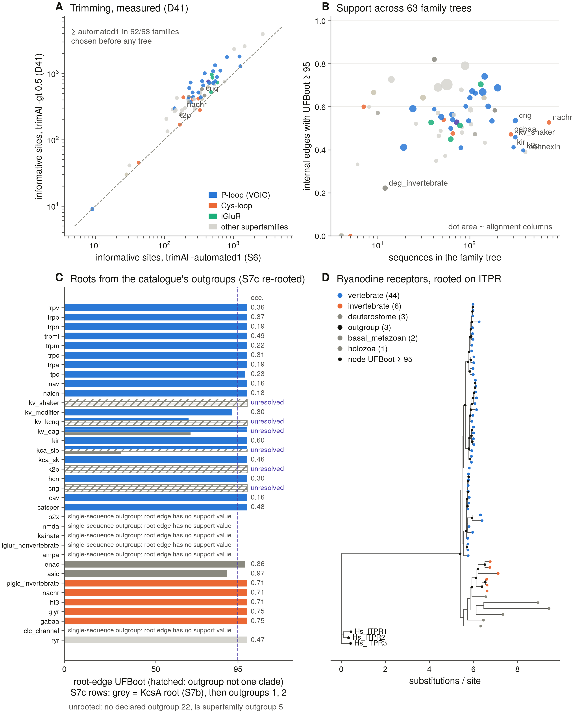
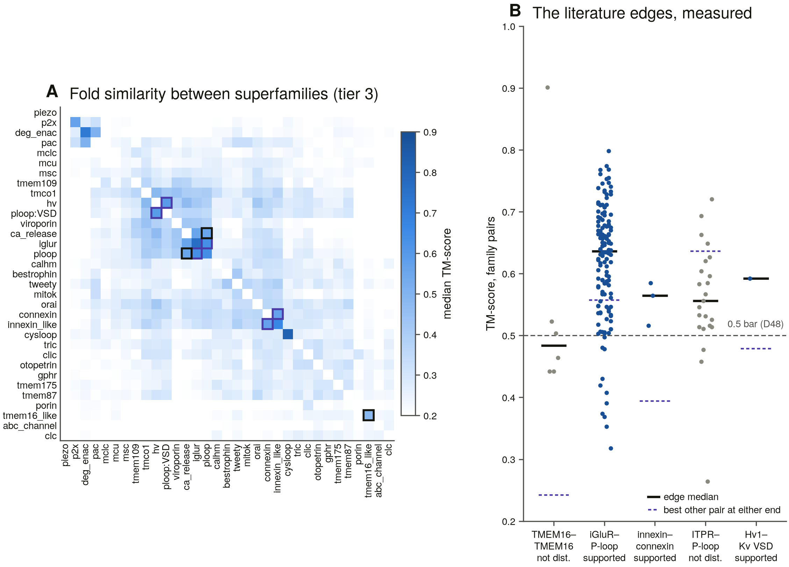
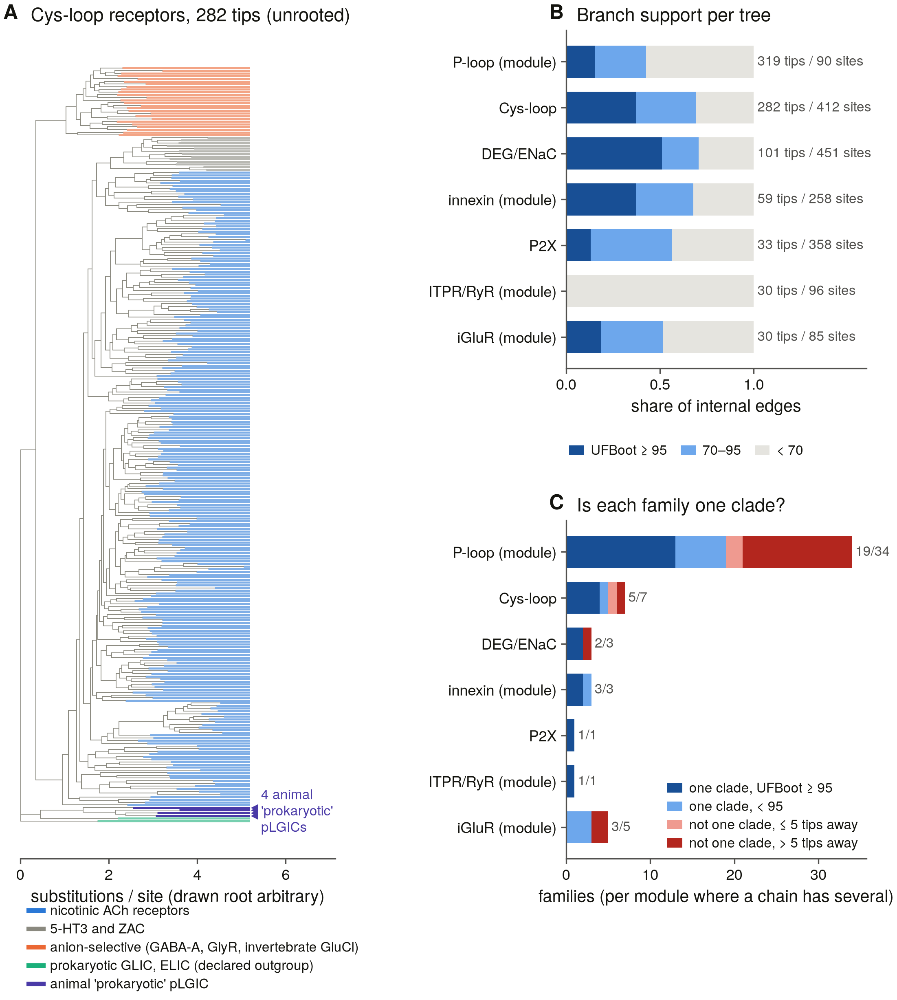
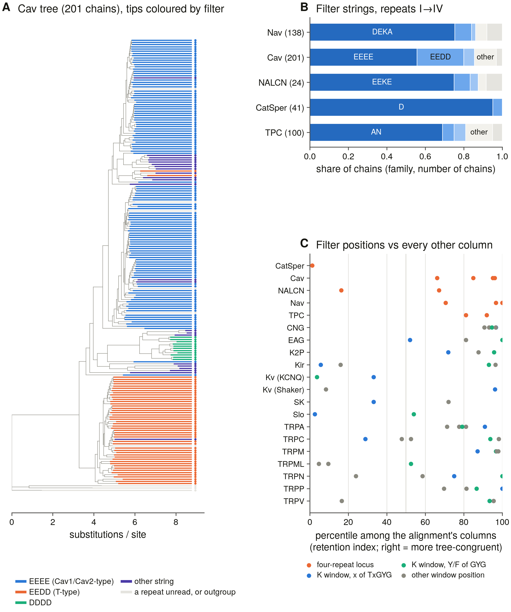
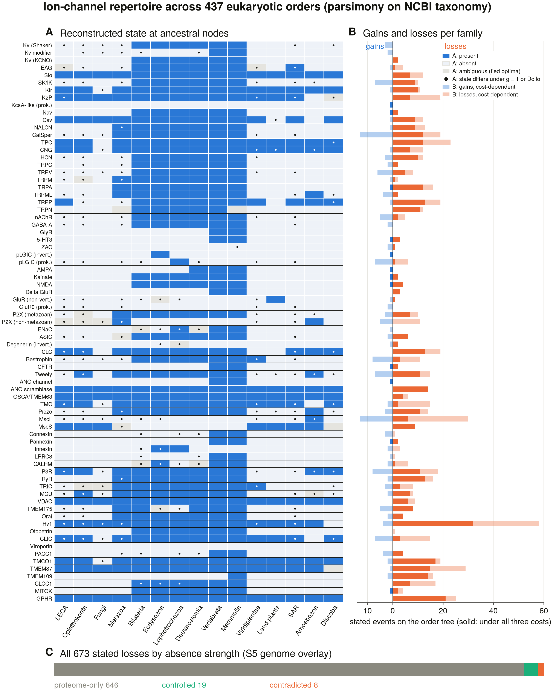

# Ion channels — census, classification and phylogeny

**Identify, classify and reconstruct the phylogeny of every ion channel.**
Not one family: the 32 independent superfamilies and 329 human pore-forming
genes that the term covers, plus their relatives across the tree of life.
The largest division, the voltage-gated-like (P-loop) superfamily, is 143 of
those genes — 79 of them potassium channels — and the other 186 are spread
across thirty-one superfamilies that share no ancestor with it.

Three deliverables, in order:

1. **A census** — what exists, in a declared search space.
2. **A classification** — what each thing is, by positive tests, with an
   audit trail that says which evidence decided.
3. **A phylogeny** — a forest of within-family and within-superfamily trees
   plus a structural network between them, because the superfamilies are not
   homologous to one another.

---

## Status board

| | |
|---|---|
| **Ledger** | S0, S1 complete 2026-08-19; S2 complete 2026-09-28 (**r3 after S2b/S2c**: every hazard rule a positive test); **S3a complete 2026-09-28**; **S4 complete 2026-09-28**; **S3b complete 2026-09-29** (census v3 over the 50-proteome panel: 2.6 % of channel-family members missed by domain search, 96 at high confidence; jackhmmer D10 24 clean / 44 killed); **S5a complete 2026-09-29** (genomic-sweep instrument + 7-genome pilot, D37); **S5b complete 2026-09-29** (all 52 genomes: matched detection 99.3 %, 72 controlled absences, 11 proteome misses, census v4, D38); **S6 complete 2026-09-29** (63 family alignments, 5,228 pore modules, D39/D40); **S7a complete 2026-09-29** (tier-1 trimming fixed at trimAl `-gt 0.5`, catalogue rooting, D41; trees running detached); **S20 complete 2026-09-29** (out of order, user-directed: auxiliary subunits and the published channelome); **S15 complete 2026-09-29** (out of order: domain search finds 94 % of channels but names 44 %, Q3); **S2d complete 2026-09-29** (census revision r4: +26,783 records, 12 new profiles, 11 of 1.25 M old calls changed, D43); **S5c complete 2026-09-30** (r4 families' genome sweep: 0 of 3,536 old cells changed, 11 controlled absences); **S2e complete 2026-09-30** (census revision r5: the viroporin signatures, +4,007 records, 0 earlier calls changed); **S2f complete 2026-09-30** (TMEM87 by descent, D45: H18 a positive test, TMEM87 present in every animal genome); **S4b complete 2026-09-30** (dense panel for S10: 439 order-level proteomes, 8.76 M sequences, 74 families present, D46); **S7b complete 2026-10-01** (63 tier-1 trees; roots defined in 26/30 multi-sequence outgroups, 22 at UFBoot ≥ 95; KcsA fails on 4 K+ families); **S7c complete 2026-10-01** (re-rooting design, D47: two declared outgroups per weakly rooted P-loop family, 107 basal sequences, 12 trees running detached); **S7d complete 2026-10-02** (12 re-rooted trees: **0/6 families resolved** under D47 — roots stay undefined for CNG, K2P, KCNQ, Shaker, Slo, EAG); **S8a complete 2026-10-02** (tier-2 design D48 + 7 trees running detached; fold network: 3/5 literature edges supported); **S8b complete 2026-10-02** (7 tier-2 trees: 3/7 rooted, 34/54 family groups one clade; the 4 animal 'prokaryotic' pLGICs group with GLIC/ELIC, not with any Cys-loop family); **S9 complete 2026-10-03** (selectivity-filter atlas, Q5: 4,523 P-loop modules read in one coordinate system, 98 % agreement with the classifier's projection; Cav3's EEDD arose once — 47/49 carriers one clade at UFBoot 100; four-repeat filter positions rank in the top decile of their alignments for tree congruence, the x of TxGYG is homoplastic); **S10a complete 2026-10-03** (repertoire reconstruction, D50: 437 eukaryotic orders on the NCBI Taxonomy tree; 19 of 75 families present at LECA under the primary cost, 13 under every cost; 673 losses stated, 19 genome-controlled, 8 contradicted by S5's proteome misses, 646 proteome-only — [report](results/repertoire/report.md)); **S10b next** (Q4: animal MscS, and the absence checks). 31 tasks (`PUBLICATION_ROADMAP.md`). |
| **Catalogue** | 103 families · 32 superfamilies · 329 human census genes · 20 hazards · validation clean. The 7 families / 8 genes added after S20 (PACC1 and seven contested proposals, `proposed.py`) entered the census in revision r4 (S2d, D43); S6 alignments and S7 trees still hold the original 68 families |
| **Verification** | S0 clean on the third pass: **115/115 Pfam accessions verified**, **162/162 exemplars resolved**, 52/52 taxon ids, 769 live requests, 0 failures ([report](results/s0_baseline/report.md)) |
| **Classifier** | benchmarked: **recall 50/72, specificity 25/25, 16/16 hazards exercised**, leave-one-out. 29 calls from domain rules and 7 from the filter motif against 24 from identity — not a nearest-neighbour lookup ([report](results/benchmark_controls/report.md)) |
| **Census v2** | **1,245,200 UniProtKB records** carry a pore signature — enumeration exact on every check (12/12 shards, 67/67 signatures). **r3** (S2b/S2c: every family call rests on a domain the family carries, D33): **24.6 % family · 35.1 % superfamily-only · 40.3 % unassigned**, reference tier not run (D31). **319/320 human census genes enumerated, 169 right family, 0 wrong** ([report](results/census_v2/report.md)) |
| **Census v3a** | one profile HMM per family (91, from 846 rule-enforced seeds, incl. an ABC-transporter decoy), benchmarked leave-one-out **69/71** on the S1 panel, **96.8 %** agreement with S2 where both call. **58.4 % of records carry a family call**; **2,919 conflicts** kept (12,857 before S2b/S2c); **human 319/320**. External check against the IP3R project's census: **0 ITPR/RYR swaps** ([report](results/census_v3/report.md)) |
| **Proteome scope** | the declared denominator: **52 panel species → 50 UniProt reference proteomes (release 2026_03) + 2 genome-only**, chosen by a stated rule; **822,499 genes**; 49/50 exact against the release README and MD5, human reissued mid-release and accepted under D35; 319/319 human census genes present ([report](results/proteome_scope/report.md)) |
| **Census v3 (panel)** | S3a's profiles swept over the 822,499-gene panel: **8,755 channel-family members; 230 (2.6 %) carry no enumerated pore signature, 96 at high confidence** — Hv1, CLIC, CNG, TRPV, pannexin and all three viroporins lead; the rest is an upper bound inflated by ankyrin/LRR-repeat proteins on repeat-dominated profiles. Human **319/320**; S3a/S3b instrument agreement 99.8 %. jackhmmer from one derived seed per family: **24 clean, 44 killed** by D10; clean runs recover **99.9 %** of profile calls ([report](results/panel_sweep/report.md)) |
| **Genome sweep** | S5a/S5b: 1,808 baits (one per species, all 91 families) → miniprot + tblastn → loci called by the S3a profiles. **52 genomes, 42.5 Gbp, 0 failures; matched detection 1,317/1,326** of each genome's own families with its own baits excluded (D37). **72 absences survive every check** (Nav *C. elegans* + sponge, P2X nematode/fly, ENaC teleosts, ZAC rat); **11 intact channel genes missing from the proteomes**, incl. all six *Takifugu* RyRs. Census v4 = census v3 + 434 genome loci ([report](results/genome_sweep/report.md)) |
| **Alignments** | S6: **6,658 sequences in 68 families** (high-confidence profile calls + intact genome loci, D39) → **63 MAFFT L-INS-i + trimAl alignments**. **5,228 pore modules** for the five tier-2 units, one extraction method per unit (projection through each family's own profile, D40); **median overlap 0.97 with UniProt-annotated modules** on 441 held-out members; six unannotated families located by a vote measured held-out to ≤ 12 residues ([report](results/alignments/report.md)) |
| **Auxiliaries & published totals** | S20: three database channelomes — **GtoPdb 285, HGNC 331, UniProt KW-0407 338, 400 in union**; the 238 genes on all three are all pore-forming. The spread is scope: auxiliary subunits (44), aquaporins, transporters, and contested families left out (GtoPdb omits 57 census pore genes; UniProt's keyword misses all 21 connexins). Auxiliaries would inflate the 320 by 24 %; 6 of 11 auxiliary families pool unrelated proteins ([report](results/auxiliary/report.md)) |
| **Method contribution** | S15 (Q3): of 7,196 final-census members, **94 % carry an enumerated pore signature but domain rules name the family for 44 %** — 0 % in Cys-loop, DEG/ENaC, P2X, CLC, iGluR, whose families share one architecture; profiles add 1.3 %, genomes 4.5 %. Human: 319 enumerated, 169 named by domain rules, 319 by profiles. Enumeration fails only for CLIC, Hv1 and viroporins ([report](results/method_contribution/report.md)) |
| **Census revision r4** | S2d (user-directed): the eight channels added after S20 brought into the census as a delta — **+26,783 UniProt records (1,271,983 total, every count exact)**, 12 profiles built alone (7 families + KChIP + 4 decoys) with the other 91 frozen and `-Z` held, so **11 of 1,245,200 old calls changed** (all explained). Human 327/328 right family, all 8 new genes included (MITOK by profile alone). Look-alikes: TMCO1/EMC3 and TMEM109/BRI3BP separate; TMEM87 is counted by descent (A and B, D45) with its GOLD domain as a positive test in animals; a GOST-superfamily tree shows the TMEM87 lineage is pan-eukaryotic (UFBoot 100) ([report](results/census_v3/r4_report.md)). Genome sweep (S5c): 52 genomes, **0 of 3,536 old cells changed**; proteome misses *Daphnia* GPHR and *Xenopus* MITOK, 11 controlled absences ([report](results/genome_sweep/r4_report.md)) |
| **Dense panel (S10)** | S4b: one release-2026_03 reference proteome per eukaryotic order — **439 orders, 8.76 M sequences**, MD5-verified; the profile sweep agrees with S3b on 2,624/2,625 shared cells; **74 of 75 census families present somewhere**, a 439 × 75 proteome-level presence matrix for repertoire evolution (absences annotation-level, D46) ([report](results/panel_density/report.md)) |
| **Phylogeny** | S7: **63 tier-1 family trees** (IQ-TREE 2, 1000 UFBoot; trimming fixed at trimAl `-gt 0.5` before any tree, D41). 36 rooted on the catalogue's outgroups: roots defined in 26 of the 30 with multi-sequence outgroups (22 at UFBoot ≥ 95); KcsA/MthK/NaK fail to root CNG, K2P, KCNQ and Shaker. **S7c/S7d re-rooted the six weak P-loop families under two declared outgroups each (D47): 0/6 resolved** — the outgroup is not one clade in 8 of 12 trees, and where a root exists it isolates 1–4 sequences and moves with the outgroup. Median 54 % of internal edges at UFBoot ≥ 95 ([report](results/phylogeny/tier1_report.md)). **S8a**: 7 tier-2 units (P-loop 319 pore-module tips … Ca²⁺-release 30), representatives and roots fixed first (D48), trees running; **fold network** over 74 families: iGluR–P-loop pore, Hv1–Kv voltage sensor and innexin–connexin supported, TMEM16/OSCA/TMC and ITPR–P-loop not distinguished, PACC1 resembles DEG/ENaC (unasserted) ([report](results/phylogeny/tier2_report.md)). **S8b**: 7 tier-2 trees, 0 failures — rooted on the declared outgroup in 3/7 (P2X, Ca²⁺-release, iGluR; the P-loop, DEG/ENaC and Cys-loop outgroups are split by the ingroup); **34 of 54 family groups one clade** (Nav and NALCN repeats each one clade; the 90-column P-loop module tree is mostly unsupported); **the four animal `plgic_prok` proteins form a clade beside GLIC/ELIC, inside no Cys-loop family** ([report § 6](results/phylogeny/tier2_report.md)) **S9 (filter atlas, Q5)**: filters follow descent — EEDD (T-type Cav) one clade of 47/49 carriers (UFBoot 100); DDDD only in *Paramecium*; Nav DEEA half in one clade, half scattered; at the four-repeat locus the varying positions are among the most tree-congruent columns (Cav III/IV 95th/96th percentile, Nav II/III 100th/97th), while the x of TxGYG changes repeatedly in K⁺ channels ([report](results/filter_atlas/report.md)) |
| **Review** | `docs/channel_review_2026.md` (+PDF) — 16 sections, ~9,500 words, **148 references, every one resolved against Europe PMC** before it could be cited, and **8 figures**, six rendered from committed tables |
| **Toolchain** | MAFFT, HMMER, trimAl, IQ-TREE 2, miniprot, BLAST+, Foldseek, `datasets` — 12/12 resolve (`results/toolchain_manifest.txt`) |

---

## Quick start

```bash
# what the catalogue claims
python3 run.py --catalogue                    # everything
python3 run.py --catalogue --scope ploop      # one superfamily
python3 -m src.catalogue --shared             # signatures shared between families

# classify proteins — by accession or by human gene symbol
python3 run.py --classify Q14524,O43497,Q719H9
python3 run.py --classify KCNQ1,KCTD1,TPTE,CFTR,ABCC8

# the benchmark panel: a positive per family, a decoy per hazard
python3 run.py --classify-preset controls_benchmark --save-results

# phylogeny
python3 run.py --phylo nav                    # tier 1, within a family
python3 run.py --phylo cysloop --tier 2       # tier 2, pore module
python3 run.py --phylo tmem16_like --tier 2   # refused — with the reason

# the offline invariants (catalogue, hazard rules, D27 refusal) — under a second
python3 scripts/selftest.py

# the literature review (edit docs/review/*.md, never the output)
python3 scripts/s0_review_refs.py     # resolve every citation against Europe PMC
python3 scripts/s0_review_build.py --pdf

# the session dashboard
python3 scripts/dashboard.py --open
```

The catalogue, classifier and phylogeny drivers need only the standard
library plus `requests`. The search / analysis / GUI paths need Biopython and
matplotlib — run those with `/opt/anaconda3/envs/piezo1/bin/python` (D18).

---

## Results in figures

One headline figure per completed task, in task order, each drawn by a script from that task's committed tables. Every figure has a plain-English description: what it shows, how it was made, and how to read its colours and marks. The descriptions live in `scripts/figure_notes.py` (edit them there, then run `python3 scripts/readme_figures.py`); the dashboard shows the same text.

**S0 — What the project counts as an ion channel, and which protein domains are misleading.**


*What it shows.* A — how many human pore-forming (channel) genes fall into each superfamily, a superfamily being a group of channel families that share a common ancestor. One superfamily, the P-loop channels (voltage-gated potassium, sodium and calcium channels and their relatives), holds 143 of the 329 genes. B — every protein domain (identified by its Pfam code, e.g. PF00520) that occurs in more than one catalogued family, and how many families carry it.

*How it was made.* Counted from the project's hand-built catalogue of channel families, after every entry was checked against the live UniProt and InterPro databases.

*How to read it.* A: bar length = number of human genes; bar colour = superfamily (blue P-loop, orange Cys-loop, green iGluR, violet CLC, greys for the rest). The numbers at the bar ends read 'census + control', e.g. '23+9' = 23 channel families plus 9 look-alike families kept only so they can be recognised and excluded. B: red bars are domains also found in proteins that are not channels, so finding that domain does not prove a protein is a channel; blue bars occur only in channels. PF00520 is found in 20 families, one of them an enzyme.

<sub>Drawn by `scripts/s0_figures.py` from the task's committed tables.</sub>

**S1 — How well the classifier names known channels, and which test made each decision.**


*What it shows.* A — 71 well-known channel proteins of known family, run through the project's classifier, grouped by superfamily. B — the 'hazards': recorded ways two different families can be confused, and how the test proteins that touch each hazard were called.

*How it was made.* Each protein was classified with itself removed from the reference set (so it cannot simply match itself). The classifier has three kinds of test: domain-architecture rules, a selectivity-filter sequence motif, and percent identity to reference proteins.

*How to read it.* A: each bar is one superfamily's test proteins, split by outcome — dark blue = named correctly by a domain rule, green = by the filter motif, light blue = by similarity to a reference protein, red = named as the wrong family, grey = no family named. 50 of 71 were named correctly; only 22 of those needed the reference comparison, so the classifier is not just finding the nearest known protein. B: blue = protein called right, red = called wrong. H2 (red) was later rewritten (S2b). H17–H20 have no bars (marked on the figure) because those hazards were added after this benchmark; they are tested in the S2d figure.

<sub>Drawn by `scripts/s1_figures.py` from the task's committed tables.</sub>

**S2 — The first full census: every database record carrying a channel domain.**


*What it shows.* A — the 1.28 million UniProt protein records that carry at least one channel-pore domain, per superfamily, split by whether the domain rules could name the family. B — the 16 largest channel families by number of records named.

*How it was made.* Every protein in UniProt with any of the listed pore domains was downloaded (the count checked exactly against UniProt's own), then classified using its domains only.

*How to read it.* A: dark blue = named to a family; light blue = placed in the superfamily but the family could not be told apart. Cys-loop, iGluR, CLC, DEG/ENaC and P2X are all light blue because every family in them has the same domains. Records the rules could not place at all (524,177) are not drawn. B: bar colour = superfamily (blue P-loop; grey others).

<sub>Drawn by `scripts/s2_figures.py` from the task's committed tables.</sub>

**S3a — Profile models: checked against the domain rules, then used where those rules gave up.**


*What it shows.* A — for each family, how often the new profile models agree with the domain rules where both make a call. B — the records that the domain rules could place only in a superfamily, and what the profile models then made of them.

*How it was made.* One statistical profile (a hidden Markov model built from a family's aligned sequences) per family; each record is given to the best-scoring profile only if it clearly beats the runner-up. Sequences used to build a profile were left out of the comparison in A.

*How to read it.* A: one dot per family; x = how many records the domain rules named (log scale), y = fraction on which the profile agrees (note the y-axis runs only from 0.993 to 1: agreement is 99.9 % overall). Dot colour = superfamily. B: each bar is 100 % of a superfamily's unresolved records (total at the right); dark blue = now named to a family, light blue = still superfamily only, grey = other or unassigned.

<sub>Drawn by `scripts/s3_figures.py` from the task's committed tables.</sub>

**S4 — The 52 species the census is measured in, and how good their data are.**


*What it shows.* The 50 species whose complete protein sets (reference proteomes) form the census's search space, plus two species with a genome but no protein set (a land snail, Cornu, and an electric ray, Torpedo; not plotted).

*How it was made.* Each species' proteome was chosen by a fixed rule and its download verified by checksum. Quality numbers come from UniProt and NCBI.

*How to read it.* One dot per species. x = BUSCO completeness: the percentage of a standard set of near-universal genes found in the protein set (higher = more complete). y = scaffold N50 of the underlying genome assembly (log scale; higher = longer continuous stretches of DNA, a less fragmented genome). Colour = lineage group. The dashed line marks 90 % completeness. Labelled species are the weak spots: those left of the line may lack genes for technical reasons, and the sponge's genome is very fragmented, so an absence in any of them is weaker evidence.

<sub>Drawn by `scripts/s4_figures.py` from the task's committed tables.</sub>

**S3b — Channels that a domain-based search would never have found.**


*What it shows.* Channel proteins in the 50 species that the profile models identify confidently but that carry none of the pore domains the first census searched for. A — by family. B — by lineage.

*How it was made.* Every protein of the 50 proteomes was scored against all family profiles; high-confidence channel calls absent from the domain-based census were counted.

*How to read it.* A: bar length = number of missed members; the label gives the share of that family's members in these species (e.g. '76 % of 33' for the proton channel Hv1, MITOK 100 % because it has no catalogued domain at all). Colour = superfamily. B: the miss rate per lineage group (missed / all members) — about 1 % in vertebrates, 12 % in plants: domain databases are built mostly from well-studied animals.

<sub>Drawn by `scripts/s3b_figures.py` from the task's committed tables.</sub>

**S5b — Which channel family is in which species — checked in the genome, not just the protein list.**


*What it shows.* Every channel family (columns, grouped by superfamily with vertical rules) in every one of the 52 species (rows, bacteria at the top, then fungi, plants, protists, simple animals, invertebrates, vertebrates, human, and three viruses at the bottom).

*How it was made.* Known channel proteins from related species were aligned to each genome (miniprot, backed up by tblastn) to find genes the protein list missed. An absence is accepted only if the same method found the family's relatives reliably in that genome and the genome is contiguous enough to hold the gene.

*How to read it.* Dark blue = found in the species' protein set. Bright blue = found only in the genome (the protein set missed a real gene). Pale blue = species with a genome but no protein set (Cornu, Torpedo). Mid grey = genome match too weak to call; light grey = partial gene or an assembly gap. Pink = only a fragment (trace). Red = a controlled absence: the gene is genuinely not there by every test. Off-white = not informative: no test could decide (e.g. no related species to search with).

<sub>Drawn by `scripts/s5_figures.py` from the task's committed tables.</sub>

**S6 — Building the alignments, and cutting out each channel's pore.**


*What it shows.* A — which census sequences went into each family's alignment. B — how much of each alignment survives trimming. C — whether the automatically cut-out pore regions ('modules') match the pore region UniProt annotates. D — how accurate the method is for families with no annotated pore.

*How it was made.* Only confidently assigned, intact sequences were aligned (MAFFT L-INS-i). The pore module was cut from each sequence by aligning it to its family profile and taking a fixed stretch of that profile.

*How to read it.* A: dark blue = included; light blue = left out because the family call was only medium confidence; grey, pink, pale = left out for other reasons (no profile call, broken genome gene, identical duplicate). B: one dot per family; x = alignment length, y = columns kept after trimming (log scales; dashed line = nothing removed); dot size = number of sequences; colour = superfamily. C: one dot per checked protein; 1.0 = the cut-out pore exactly matches UniProt's annotation (overlap score, Jaccard); 436 of 441 score above 0.8 (dashed line). D: bar = error in placing the pore when the family's own annotation is hidden; under the dashed line (12 positions) counts as accurate. Innexins fail (80), so the method is used only for the six families listed in violet.

<sub>Drawn by `scripts/s6_figures.py` from the task's committed tables.</sub>

**S7a — Choosing how to trim alignments before building trees.**


*What it shows.* For each family alignment, how many informative positions (columns that can distinguish between branches of a tree) two trimming settings keep.

*How it was made.* Alignments contain gappy, unreliable columns that are usually removed before tree-building. Two settings of the trimAl tool were compared on the alignments alone — before any tree was built, so the choice could not be steered by the trees.

*How to read it.* One dot per family (colour = superfamily). x = informative positions kept by the automatic setting used in S6; y = kept by the 'keep any column at least half filled' setting (both log scales). Dots above the dashed diagonal mean the second setting keeps more; it does in 62 of 63 families, so it was adopted.

<sub>Drawn by `scripts/s7_figures.py` from the task's committed tables.</sub>

**S7b/S7d — Family trees: how well supported they are, and whether they can be rooted.**



*What it shows.* A — the trimming choice (as in the S7a figure). B — how confident each of the 63 family trees is. C — whether each tree's root (its oldest split) is reliable. D — one example tree, the ryanodine receptors.

*How it was made.* One maximum-likelihood tree per family (IQ-TREE), with 1000 ultrafast bootstrap replicates (UFBoot): a support score from 0–100 for each branch, where ≥ 95 is conventionally strong. Trees are rooted by adding a related outgroup family named in the catalogue in advance; the root sits where the outgroup joins.

*How to read it.* B: one dot per family; x = sequences in the tree, y = fraction of branches with support ≥ 95; dot size = alignment length; colour = superfamily. C: bar = support for the root branch (dashed line = 95); 'occ.' = how much of the alignment the outgroup sequences fill. Hatched bars = the outgroup did not stay together as one group, so the root is undefined. The six potassium-type families re-tested with two new outgroups each show three bars (grey = original root, then the two new ones) and are all marked 'unresolved'. Text rows = outgroup of one sequence, which gives no support value. D: the tree itself; branch length = amount of sequence change; tip colour = lineage; black dots = branches with support ≥ 95; rooted on the three human IP3 receptors (bottom left).

<sub>Drawn by `scripts/s7_figures.py` from the task's committed tables.</sub>

**S20 — Why published counts of human ion channels disagree (240–400).**


*What it shows.* A — three curated database lists of human ion channels, split into what each actually contains. B — real pore-forming genes each list leaves out. C — 'auxiliary' subunits (proteins that sit on channels but do not form the pore), grouped by true relatedness. D — how many such auxiliary proteins the profile models find in the 50 species, and how many are genuine.

*How it was made.* The three lists (GtoPdb, HGNC, UniProt keyword 'ion channel') were matched gene by gene to the catalogue. Relatedness in C comes from all-against-all sequence comparison; in D a hit counts as genuine if its best match in the human proteome is that auxiliary group.

*How to read it.* A: dark blue = genuine pore-forming channel genes; orange = auxiliary subunits; other colours = aquaporins, transporters, enzymes, claudins, pseudogenes and similar non-channels. Totals at the right. B: one bar per list (dark blue GtoPdb, light blue HGNC, orange UniProt); e.g. UniProt omits all 21 connexins. C: each bar is one auxiliary family; separate coloured segments are groups of proteins unrelated to each other — 6 of 11 families mix unrelated proteins. D: log scale; dark blue = genuine; pink = hits whose best human match is an unrelated protein (shared repeat domains).

<sub>Drawn by `scripts/s20_figures.py` from the task's committed tables.</sub>

**S15 — Which search method finds each channel.**


*What it shows.* A — every member of the final census, per superfamily, by the first method that finds it. B — the curated human channel genes, and how many each method finds and names correctly.

*How it was made.* Methods applied in order of cost: domain search, then profile models, then the genome sweep. A member is credited to the first method that finds it.

*How to read it.* A: each bar = 100 % of a superfamily's members (count at the right). Dark blue = domain search found it and named the right family; light blue = domain search found it but could not name the family; orange = only the profile models found it; green = only the genome sweep found it. Overall domain search finds 94 % but names only 44 %. B: three bars per superfamily — light blue = found by domain search, dark blue = named correctly by domain rules, orange = named correctly by profiles (count of human genes at the right).

<sub>Drawn by `scripts/s15_figures.py` from the task's committed tables.</sub>

**S2d — Eight newly added channels brought into the census, and whether their look-alikes can be told apart.**


*What it shows.* A — the 26,783 database records added for the newly catalogued channel families and their non-channel look-alikes (decoys). B — for well-studied (reviewed) records, how clearly the correct profile beats the next best one.

*How it was made.* The new families' domains were searched as an addition to the existing census, profiles built for each, and every record assigned to its best profile.

*How to read it.* A: bar = records by their final call; 'decoy:' = a non-channel look-alike; a name in [brackets] = placed in that superfamily but not named to a family. Colour = confidence of the profile call (dark blue high, light blue medium, greys low or none). B: x = margin over the runner-up profile (0 = tie, 1 = no contest); dashed line = 0.30, the bar for a high confidence call. Open circles = proteins used to build the profile; filled = proteins held out as a fair test. Shaded bands pair each channel with its look-alike (hazards H17–H19); all separate cleanly.

<sub>Drawn by `scripts/s3r4_figures.py` from the task's committed tables.</sub>

**S5c — The seven newly added channel families across the 52 genomes.**


*What it shows.* Each new family (columns) in each species (rows, bacteria at the top to human, viruses at the bottom), checked in the genome as in the S5b figure.

*How it was made.* Same genome search and absence tests as S5b, run for the new families only; all earlier results were confirmed unchanged.

*How to read it.* Same colours as the S5b matrix: dark blue = in the protein set; bright blue = only in the genome (protein set missed it); pale blue = genome-only species; grey = weak or partial; pink = trace; red = controlled absence (truly not there); off-white = cannot be decided. TMEM87 is present in every animal; its presence in fungi, plants and some protists is real (see the GOST tree figure).

<sub>Drawn by `scripts/s5r4_figures.py` from the task's committed tables.</sub>

**S2f — TMEM87 is an ancient lineage found across eukaryotes.**


*What it shows.* A tree of 115 proteins from the GOST protein superfamily: the proposed channel TMEM87 and its non-channel relatives (GPR107/108 and the fungal, plant and protist GOST proteins).

*How it was made.* Maximum-likelihood tree (IQ-TREE) with 1000 bootstrap replicates. The tree is unrooted; it is drawn hanging from an arbitrary point, so left-to-right order does not mean older to younger.

*How to read it.* Tip colour = what the protein is: dark blue = animal TMEM87 (carrying TMEM87's animal-specific GOLD domain); light blue = other animal GOST proteins; green = plants and algae; orange = fungi; violet = single-celled relatives of animals; grey = other protists. Squares = non-animal proteins the profile models call TMEM87. Small black dots = branches with support ≥ 95. Branch length = amount of sequence change. The animal TMEM87s and the squares fall in one strongly supported group (support 100), apart from GPR107/108.

<sub>Drawn by `scripts/s7_gost_tree.py` from the task's committed tables.</sub>

**S4b — Every channel family across 439 orders of eukaryotes.**


*What it shows.* Presence of each channel family (rows) in one representative protein set per eukaryotic order (columns: 439 orders, grouped into animals, fungi, plants and protists).

*How it was made.* One reference proteome per order, chosen by a fixed rule, scanned with all family profiles.

*How to read it.* A blue mark = the family was confidently found in that order's protein set; blank = not found. Long unbroken runs show families present throughout a kingdom (e.g. VDAC, OSCA, GPHR in nearly all eukaryotes); runs only in the middle of the animal block are vertebrate-specific (glycine and 5-HT3 receptors, connexins, pannexins, CFTR). Blank cells are weaker evidence than in the S5b figure: a protein set can simply miss a gene, and these were not checked in the genome.

<sub>Drawn by `scripts/s4b_report.py` from the task's committed tables.</sub>

**S8a — Which channel superfamilies share a 3-D shape.**



*What it shows.* Most channel superfamilies have no sequence similarity, so they cannot be placed in one tree. Instead this compares their predicted 3-D structures. A — how similar in shape every pair of superfamilies is. B — five relationships the literature proposes, tested.

*How it was made.* One AlphaFold-predicted structure per family (only the confidently predicted parts), cut to the part each comparison is about (the pore, or the voltage sensor), compared pairwise with TM-align. TM-score runs from 0 (unrelated shapes) to 1 (identical); above about 0.5 usually means the same fold. The pass rule was fixed before measuring: median score ≥ 0.5 and each side's closest match among all other superfamilies is the other side.

*How to read it.* A: each cell = the median similarity between two superfamilies' families (darker blue = more similar; scale 0–1). Diagonal cells compare different families within the same superfamily (a structure is never compared with itself); hatched = only one family, so nothing to compare. Rows are ordered so similar superfamilies sit together. Boxed cells = the literature's proposed relationships (violet box = supported, black = not distinguished). B: each dot = one family pair behind a proposed relationship (blue = supported, grey = not); black line = median; violet dashed line = the best score either side reaches with anything else; grey dashed line = the 0.5 bar. Supported: glutamate-receptor pore vs potassium-channel pore, Hv1 vs the Kv voltage sensor, innexins vs connexins.

<sub>Drawn by `scripts/s8_figures.py` from the task's committed tables.</sub>

**S8b — Trees within each channel superfamily.**



*What it shows.* Seven trees, one for each group of related channel families whose sequences can be lined up. A — the tree of the pentameric (Cys-loop) receptors, the largest full-length one. B — how well supported each tree's branches are. C — whether each family comes out as a single branch of its tree.

*How it was made.* Representative sequences were chosen by a fixed rule before any tree was built, aligned with MAFFT, trimmed with trimAl, and the tree estimated by maximum likelihood (IQ-TREE 2) with 1000 ultrafast bootstrap replicates. Four of the trees use only the pore region (each repeat of a four-repeat channel is its own tip); the other three use whole proteins. A tree counts as rooted only if its declared outgroup forms one branch.

*How to read it.* A: each horizontal line ending at the right is one sequence, coloured by receptor group (blue nicotinic acetylcholine receptors; grey 5-HT3 and ZAC; orange the anion-selective GABA-A, glycine and invertebrate glutamate-gated chloride receptors; green the bacterial GLIC and ELIC; violet, with arrowheads, four animal proteins the bacterial profile claimed). Horizontal distance is substitutions per site. The tree is unrooted: the four animal proteins sit between GLIC and ELIC, so the declared bacterial outgroup is not one branch and the left edge is only where the program drew it. B: each bar is one tree; dark blue = share of branches with bootstrap support of 95 or more, light blue = 70 to 95, grey = below 70; the text gives the number of sequences and of informative alignment columns. The pore-only P-loop tree (319 sequences on 90 columns) is mostly unsupported. C: each bar counts families (each repeat separately for chains with several): dark blue = one branch with support of 95 or more, light blue = one branch with less, pink = not one branch but at most 5 other sequences in the way, red = more than 5; the fraction is families that are one branch. ITPR/RyR shows only RyR, because ITPR is that tree's outgroup.

<sub>Drawn by `scripts/s8_figures.py` from the task's committed tables.</sub>

**S9 — Do selectivity filters follow the family tree?.**



*What it shows.* The selectivity filter, the few residues of the pore that decide which ion passes, read in every P-loop channel and laid on the family trees. A — the calcium-channel (Cav) tree with every sequence coloured by its filter. B — which filters the four-repeat channels (sodium, calcium, NALCN, CatSper, two-pore) carry. C — for every family, how closely each filter position follows the tree compared with every other position in the same alignment.

*How it was made.* Every pore region was aligned onto one shared reference alignment (MAFFT), and the filter read at the columns occupied by the potassium channel KcsA's TVGYG motif and by the four filter residues of the human heart sodium channel Nav1.5 (DEKA). The reads were checked against the classifier's independent method (98 % agreement on 363 four-repeat channels). Each filter was then scored on the maximum-likelihood trees by parsimony: how many times it must have changed, compared with every other alignment column (the retention index, where 1 means each variant arose once).

*How to read it.* A: each horizontal line ending at the right is one sequence; horizontal distance is substitutions per site, and the three light-grey lines at the bottom are the bacterial potassium channels used as the outgroup. Blue = EEEE (the high-voltage calcium channels), orange = EEDD (the low-voltage T-type channels), green = DDDD (all from the ciliate Paramecium), violet = any other filter, light grey = a repeat that could not be read. Forty-seven of the 49 EEDD sequences form the one orange block, a branch with bootstrap support 100: the T-type filter arose once. B: each bar is one family (number of sequences in brackets), split into its most common filters from dark to light blue, then 'other' (off-white) and unread (grey); the letters are the residues of repeats I to IV (CatSper and the two-pore channels have one and two repeats). The unlabelled second segments are DEEA (Nav), EKEE (NALCN). C: each dot is one filter position in one family, placed by its percentile among all the alignment's columns; right of the 50 line = follows the tree more closely than a typical position. Orange = a four-repeat filter position; blue = the variable middle residue of the potassium motif TxGYG; green = its Y/F; grey = other positions of the window. Four-repeat positions and the Y/F sit mostly far right; the middle residue x is often far left, i.e. it has changed many times independently.

<sub>Drawn by `scripts/s9_figures.py` from the task's committed tables.</sub>

**S10a — Which ion channels did each ancestor carry?.**



*What it shows.* For each of the 75 census channel families, whether it was present in fifteen ancestors on the tree of eukaryotes, from the last eukaryotic common ancestor (LECA) to the ancestor of mammals, and how often it was gained and lost. A — the reconstructed state at each ancestor. B — the number of gains and losses placed on the tree for each family. C — every inferred loss sorted by how well it is backed by the genome search.

*How it was made.* Each family was scored present or absent in one reference proteome for each of 437 eukaryotic orders (present = a high-confidence profile match; a medium-confidence match, or an absence in a proteome less than 70 % complete by BUSCO, counts as unknown). The states were laid on the NCBI Taxonomy tree, unresolved branchings kept as they are, and the fewest gains and losses that explain them were found by parsimony, with a gain costing two losses. The same was repeated with a gain costing one loss and with only one gain allowed, to see which conclusions depend on that choice. Losses were then compared with the genome search of the 37 panel species that sit in these orders.

*How to read it.* A: rows are families, grouped by superfamily (black lines); columns are ancestors. Dark blue = present, pale blue = absent, grey = the data fit present and absent equally well. A dot marks an ancestor whose state changes under one of the other two costs; cells without a dot hold under all three. B: bars to the left are gains, to the right losses (blue and orange); the solid part is placed identically under all three costs, the pale part only under the main one. A family can be present at LECA (A) and still show no gain in B, because its origin before LECA is not a branch of this tree. C: one bar of all 673 losses inferred under the main cost: grey = seen only as missing from proteomes; green = confirmed by a controlled genome absence in a species below the loss; orange = contradicted, because the genome search found an intact gene the proteome lacks. Most losses are grey: they are annotation-level absences, not proven gene losses.

<sub>Drawn by `scripts/s10_figures.py` from the task's committed tables.</sub>

---

## What makes this hard, in three examples

**A domain hit is not a family.** `PF00520` — the pore module — is carried by
20 catalogued families, including a phosphatase that is not a channel and a
proton channel that has no pore domain. Nav, Cav, NALCN and CatSper carry
four copies each and nothing else that distinguishes them.

What separates them is the selectivity filter: one residue from each repeat.
Align to human Nav1.5 and read positions 372 / 898 / 1419 / 1711:

```
   SCN5A   → DEKA      CACNA1C → EEEE      NALCN   → EEKE
   SCN1A   → DEKA      CACNA1G → EEDD      SCN11A  → DEKA
```

Six of six correct, ~1.1 s per protein. `CACNA1G` reading **EEDD** rather
than EEEE is not an error — the T-type channels really do differ at the
filter, and the classifier records the subfamily rather than flattening it.

**Most TRP channels carry no `PF00520` at all.** Measured 2026-08-19: TRPV1,
TRPV5, TRPA1 and TRPM2 do; TRPC3, TRPM8, MCOLN1, MCOLN2 and PKD2 do not.
A census enumerating P-loop channels by that accession loses most of the TRP
division silently, so this one enumerates from the union of seven pore
models instead.

**There is no tree of ion channels.** A nicotinic receptor and a Kv channel
share no alignable position. `build_tier2()` raises `NotAlignable` for any
superfamily the catalogue marks non-homologous, and there is no
`build_tier3()`: cross-superfamily comparison produces a fold-similarity
network with no branch lengths and no support values.

---

## Layout

```
src/catalogue/    the subject: 103 families, 32 superfamilies, 20 hazards
src/classify/     three tiers → one ChannelCall with an audit trail
src/phylo/        pore modules, tier-1/tier-2 forests, the tier-3 network
src/utils/scope.py  narrows the catalogue to a run's scope
src/core, src/databases, src/analysis, src/discovery, src/investigation, src/gui
                  the ported app (NCBI / Ensembl / UniProt / Compara /
                  AlphaFold / Foldseek / BLAST, MSA, trees, discovery scoring)
scripts/          per-task tooling; s0_* verification, s1_* benchmark,
                  s14_* manuscript assembly, dashboard, figure style
docs/             the biology baseline, the scope decision, the
                  classification rules, the phylogeny protocol, task briefs
presets/          channelome_human, controls_benchmark, and scoped surveys
results/          committed tables and reports, one directory per task
```

Read `INTERFACE.md` before opening any source file.

---

## The rules this project runs on

The full Decisions log is in `PUBLICATION_ROADMAP.md`; D1–D18 are inherited
from the PIEZO and IP3R projects, D23–D28 are new here.

- **D23** The scope of "ion channel" is declared, not assumed — six boundary
  questions with six recorded answers, and anything excluded stays in the
  catalogue with a status so the exclusion is a decision rather than an
  omission.
- **D24** Membership and mechanism are separate calls. The CLC transporters
  are in the CLC family and are not channels.
- **D25** A signature is evidence only at the level where it is diagnostic.
- **D26** The four-repeat families are separated by their selectivity filter,
  verified against the reference before every use.
- **D27** The phylogeny is a forest; non-alignable comparisons go to the fold
  network, and the code refuses to do otherwise.
- **D28** A missing tool disables a test loudly. No silent fallback to a
  weaker method, ever.
- **H15** The gene symbol is never consulted. `KCNE*`, `CACNB*`, `CACNG*`,
  `SCN*B`, `CATSPERB` and `KCTD*` all sort inside the channel symbol space
  and none is a pore.

---

## Provenance

Ported from `../ip3r_genes` (the IP3 receptor family), itself ported from
`../piezo_genes`. The app, the figure style, the dashboard, the
manuscript-assembly and claim-checking tooling and the session protocol come
from there; **no result does**. ITPR and RYR appear here as two of 103
families, and the parent project's census of them is an external check on
this one rather than an input to it.

Findings so far: `FINDINGS.md`. Operational record: `SESSION_LOG.md`.
