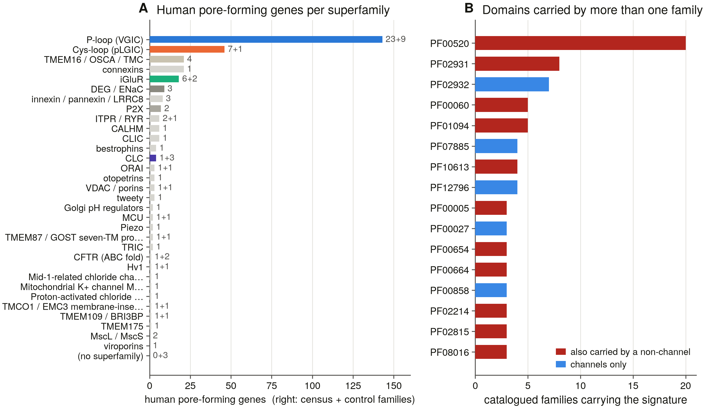

# Ion channels — census, classification and phylogeny

**Identify, classify and reconstruct the phylogeny of every ion channel.**
Not one family: the 25 independent superfamilies and 320 human pore-forming
genes that the term covers, plus their relatives across the tree of life.
The largest division, the voltage-gated-like (P-loop) superfamily, is 143 of
those genes — 79 of them potassium channels — and the other 177 are spread
across twenty-four superfamilies that share no ancestor with it.

Three deliverables, in order:

1. **A census** — what exists, in a declared search space.
2. **A classification** — what each thing is, by positive tests, with an
   audit trail that says which evidence decided.
3. **A phylogeny** — a forest of within-family and within-superfamily trees
   plus a structural network between them, because the superfamilies are not
   homologous to one another.

---

## Status board

| | |
|---|---|
| **Ledger** | S0, S1 complete 2026-08-19; S2 complete 2026-09-28 (**r3 after S2b/S2c**: every hazard rule a positive test); **S3a complete 2026-09-28**; **S4 complete 2026-09-28**; **S3b complete 2026-09-29** (census v3 over the 50-proteome panel: 2.6 % of channel-family members missed by domain search, 96 at high confidence; jackhmmer D10 24 clean / 44 killed); **S5a complete 2026-09-29** (genomic-sweep instrument + 7-genome pilot, D37); S5b next. 30 tasks (`PUBLICATION_ROADMAP.md`). |
| **Catalogue** | 91 families · 25 superfamilies · 320 human census genes · 16 hazards · validation clean |
| **Verification** | S0 clean on the third pass: **115/115 Pfam accessions verified**, **162/162 exemplars resolved**, 52/52 taxon ids, 769 live requests, 0 failures ([report](results/s0_baseline/report.md)) |
| **Classifier** | benchmarked: **recall 50/72, specificity 25/25, 16/16 hazards exercised**, leave-one-out. 29 calls from domain rules and 7 from the filter motif against 24 from identity — not a nearest-neighbour lookup ([report](results/benchmark_controls/report.md)) |
| **Census v2** | **1,245,200 UniProtKB records** carry a pore signature — enumeration exact on every check (12/12 shards, 67/67 signatures). **r3** (S2b/S2c: every family call rests on a domain the family carries, D33): **24.6 % family · 35.1 % superfamily-only · 40.3 % unassigned**, reference tier not run (D31). **319/320 human census genes enumerated, 169 right family, 0 wrong** ([report](results/census_v2/report.md)) |
| **Census v3a** | one profile HMM per family (91, from 846 rule-enforced seeds, incl. an ABC-transporter decoy), benchmarked leave-one-out **69/71** on the S1 panel, **96.8 %** agreement with S2 where both call. **58.4 % of records carry a family call**; **2,919 conflicts** kept (12,857 before S2b/S2c); **human 319/320**. External check against the IP3R project's census: **0 ITPR/RYR swaps** ([report](results/census_v3/report.md)) |
| **Proteome scope** | the declared denominator: **52 panel species → 50 UniProt reference proteomes (release 2026_03) + 2 genome-only**, chosen by a stated rule; **822,499 genes**; 49/50 exact against the release README and MD5, human reissued mid-release and accepted under D35; 319/319 human census genes present ([report](results/proteome_scope/report.md)) |
| **Census v3 (panel)** | S3a's profiles swept over the 822,499-gene panel: **8,755 channel-family members; 230 (2.6 %) carry no enumerated pore signature, 96 at high confidence** — Hv1, CLIC, CNG, TRPV, pannexin and all three viroporins lead; the rest is an upper bound inflated by ankyrin/LRR-repeat proteins on repeat-dominated profiles. Human **319/320**; S3a/S3b instrument agreement 99.8 %. jackhmmer from one derived seed per family: **24 clean, 44 killed** by D10; clean runs recover **99.9 %** of profile calls ([report](results/panel_sweep/report.md)) |
| **Genome sweep (pilot)** | S5a: 1,808 baits (one per species, all 91 families) → miniprot + tblastn → loci called by the S3a profiles. 7 genomes, 6.0 Gbp: **matched detection 172/173** of each genome's own families with its own baits excluded; a bait from another lineage finds nothing (D37). **0 intact channel genes missing from the six gene sets; 10 absences survive every check**, incl. Nav and P2X in *C. elegans*; mouse introns up to 996 kb ([report](results/genome_sweep/report.md)) |
| **Phylogeny** | builders and the tier-3 network built; smoke-tested on the Cys-loop superfamily (8 refs, rooted on GLIC/ELIC, 52 s — anion and cation receptors separate at 100 %); real trees run in S7/S8 |
| **Review** | `docs/channel_review_2026.md` (+PDF) — 16 sections, ~9,500 words, **148 references, every one resolved against Europe PMC** before it could be cited, and **8 figures**, six rendered from committed tables |
| **Toolchain** | MAFFT, HMMER, trimAl, IQ-TREE 2, miniprot, BLAST+, Foldseek, `datasets` — 12/12 resolve (`results/toolchain_manifest.txt`) |

---

## Quick start

```bash
# what the catalogue claims
python3 run.py --catalogue                    # everything
python3 run.py --catalogue --scope ploop      # one superfamily
python3 -m src.catalogue --shared             # signatures shared between families

# classify proteins — by accession or by human gene symbol
python3 run.py --classify Q14524,O43497,Q719H9
python3 run.py --classify KCNQ1,KCTD1,TPTE,CFTR,ABCC8

# the benchmark panel: a positive per family, a decoy per hazard
python3 run.py --classify-preset controls_benchmark --save-results

# phylogeny
python3 run.py --phylo nav                    # tier 1, within a family
python3 run.py --phylo cysloop --tier 2       # tier 2, pore module
python3 run.py --phylo tmem16_like --tier 2   # refused — with the reason

# the offline invariants (catalogue, hazard rules, D27 refusal) — under a second
python3 scripts/selftest.py

# the literature review (edit docs/review/*.md, never the output)
python3 scripts/s0_review_refs.py     # resolve every citation against Europe PMC
python3 scripts/s0_review_build.py --pdf

# the session dashboard
python3 scripts/dashboard.py --open
```

The catalogue, classifier and phylogeny drivers need only the standard
library plus `requests`. The search / analysis / GUI paths need Biopython and
matplotlib — run those with `/opt/anaconda3/envs/piezo1/bin/python` (D18).

---



*The subject, counted. **A** — human pore-forming genes per superfamily, with
census + control family counts at the right of each bar: the P-loop
superfamily is 143 of the 320 genes and twenty-four other superfamilies
share the rest. **B** — every domain signature carried by more than one
catalogued family. Red bars are the signatures also carried by something the
catalogue does not count as a channel; `PF00520` reaches twenty families,
including a phosphatase. Drawn from `results/s0_baseline/` by
`scripts/s0_figures.py`.*

---

## What makes this hard, in three examples

**A domain hit is not a family.** `PF00520` — the pore module — is carried by
20 catalogued families, including a phosphatase that is not a channel and a
proton channel that has no pore domain. Nav, Cav, NALCN and CatSper carry
four copies each and nothing else that distinguishes them.

What separates them is the selectivity filter: one residue from each repeat.
Align to human Nav1.5 and read positions 372 / 898 / 1419 / 1711:

```
   SCN5A   → DEKA      CACNA1C → EEEE      NALCN   → EEKE
   SCN1A   → DEKA      CACNA1G → EEDD      SCN11A  → DEKA
```

Six of six correct, ~1.1 s per protein. `CACNA1G` reading **EEDD** rather
than EEEE is not an error — the T-type channels really do differ at the
filter, and the classifier records the subfamily rather than flattening it.

**Most TRP channels carry no `PF00520` at all.** Measured 2026-08-19: TRPV1,
TRPV5, TRPA1 and TRPM2 do; TRPC3, TRPM8, MCOLN1, MCOLN2 and PKD2 do not.
A census enumerating P-loop channels by that accession loses most of the TRP
division silently, so this one enumerates from the union of seven pore
models instead.

**There is no tree of ion channels.** A nicotinic receptor and a Kv channel
share no alignable position. `build_tier2()` raises `NotAlignable` for any
superfamily the catalogue marks non-homologous, and there is no
`build_tier3()`: cross-superfamily comparison produces a fold-similarity
network with no branch lengths and no support values.

---

## Layout

```
src/catalogue/    the subject: 91 families, 25 superfamilies, 16 hazards
src/classify/     three tiers → one ChannelCall with an audit trail
src/phylo/        pore modules, tier-1/tier-2 forests, the tier-3 network
src/utils/scope.py  narrows the catalogue to a run's scope
src/core, src/databases, src/analysis, src/discovery, src/investigation, src/gui
                  the ported app (NCBI / Ensembl / UniProt / Compara /
                  AlphaFold / Foldseek / BLAST, MSA, trees, discovery scoring)
scripts/          per-task tooling; s0_* verification, s1_* benchmark,
                  s14_* manuscript assembly, dashboard, figure style
docs/             the biology baseline, the scope decision, the
                  classification rules, the phylogeny protocol, task briefs
presets/          channelome_human, controls_benchmark, and scoped surveys
results/          committed tables and reports, one directory per task
```

Read `INTERFACE.md` before opening any source file.

---

## The rules this project runs on

The full Decisions log is in `PUBLICATION_ROADMAP.md`; D1–D18 are inherited
from the PIEZO and IP3R projects, D23–D28 are new here.

- **D23** The scope of "ion channel" is declared, not assumed — six boundary
  questions with six recorded answers, and anything excluded stays in the
  catalogue with a status so the exclusion is a decision rather than an
  omission.
- **D24** Membership and mechanism are separate calls. The CLC transporters
  are in the CLC family and are not channels.
- **D25** A signature is evidence only at the level where it is diagnostic.
- **D26** The four-repeat families are separated by their selectivity filter,
  verified against the reference before every use.
- **D27** The phylogeny is a forest; non-alignable comparisons go to the fold
  network, and the code refuses to do otherwise.
- **D28** A missing tool disables a test loudly. No silent fallback to a
  weaker method, ever.
- **H15** The gene symbol is never consulted. `KCNE*`, `CACNB*`, `CACNG*`,
  `SCN*B`, `CATSPERB` and `KCTD*` all sort inside the channel symbol space
  and none is a pore.

---

## Provenance

Ported from `../ip3r_genes` (the IP3 receptor family), itself ported from
`../piezo_genes`. The app, the figure style, the dashboard, the
manuscript-assembly and claim-checking tooling and the session protocol come
from there; **no result does**. ITPR and RYR appear here as two of ninety-one
families, and the parent project's census of them is an external check on
this one rather than an input to it.

Findings so far: `FINDINGS.md`. Operational record: `SESSION_LOG.md`.
