# Ion channels — census, classification and phylogeny

**Identify, classify and reconstruct the phylogeny of every ion channel.**
Not one family: the 32 independent superfamilies and 328 human pore-forming
genes that the term covers, plus their relatives across the tree of life.
The largest division, the voltage-gated-like (P-loop) superfamily, is 143 of
those genes — 79 of them potassium channels — and the other 185 are spread
across thirty-one superfamilies that share no ancestor with it.

Three deliverables, in order:

1. **A census** — what exists, in a declared search space.
2. **A classification** — what each thing is, by positive tests, with an
   audit trail that says which evidence decided.
3. **A phylogeny** — a forest of within-family and within-superfamily trees
   plus a structural network between them, because the superfamilies are not
   homologous to one another.

---

## Status board

| | |
|---|---|
| **Ledger** | S0, S1 complete 2026-08-19; S2 complete 2026-09-28 (**r3 after S2b/S2c**: every hazard rule a positive test); **S3a complete 2026-09-28**; **S4 complete 2026-09-28**; **S3b complete 2026-09-29** (census v3 over the 50-proteome panel: 2.6 % of channel-family members missed by domain search, 96 at high confidence; jackhmmer D10 24 clean / 44 killed); **S5a complete 2026-09-29** (genomic-sweep instrument + 7-genome pilot, D37); **S5b complete 2026-09-29** (all 52 genomes: matched detection 99.3 %, 72 controlled absences, 11 proteome misses, census v4, D38); **S6 complete 2026-09-29** (63 family alignments, 5,228 pore modules, D39/D40); **S7a complete 2026-09-29** (tier-1 trimming fixed at trimAl `-gt 0.5`, catalogue rooting, D41; trees running detached); **S20 complete 2026-09-29** (out of order, user-directed: auxiliary subunits and the published channelome); **S15 complete 2026-09-29** (out of order: domain search finds 94 % of channels but names 44 %, Q3); **S2d complete 2026-09-29** (census revision r4: +26,783 records, 12 new profiles, 11 of 1.25 M old calls changed, D43); **S5c complete 2026-09-30** (r4 families' genome sweep: 0 of 3,536 old cells changed, 11 controlled absences); **S2e complete 2026-09-30** (census revision r5: the viroporin signatures, +4,007 records, 0 earlier calls changed); S7b next once its trees finish. 30 tasks (`PUBLICATION_ROADMAP.md`). |
| **Catalogue** | 103 families · 32 superfamilies · 328 human census genes · 20 hazards · validation clean. The 7 families / 8 genes added after S20 (PACC1 and seven contested proposals, `proposed.py`) entered the census in revision r4 (S2d, D43); S6 alignments and S7 trees still hold the original 68 families |
| **Verification** | S0 clean on the third pass: **115/115 Pfam accessions verified**, **162/162 exemplars resolved**, 52/52 taxon ids, 769 live requests, 0 failures ([report](results/s0_baseline/report.md)) |
| **Classifier** | benchmarked: **recall 50/72, specificity 25/25, 16/16 hazards exercised**, leave-one-out. 29 calls from domain rules and 7 from the filter motif against 24 from identity — not a nearest-neighbour lookup ([report](results/benchmark_controls/report.md)) |
| **Census v2** | **1,245,200 UniProtKB records** carry a pore signature — enumeration exact on every check (12/12 shards, 67/67 signatures). **r3** (S2b/S2c: every family call rests on a domain the family carries, D33): **24.6 % family · 35.1 % superfamily-only · 40.3 % unassigned**, reference tier not run (D31). **319/320 human census genes enumerated, 169 right family, 0 wrong** ([report](results/census_v2/report.md)) |
| **Census v3a** | one profile HMM per family (91, from 846 rule-enforced seeds, incl. an ABC-transporter decoy), benchmarked leave-one-out **69/71** on the S1 panel, **96.8 %** agreement with S2 where both call. **58.4 % of records carry a family call**; **2,919 conflicts** kept (12,857 before S2b/S2c); **human 319/320**. External check against the IP3R project's census: **0 ITPR/RYR swaps** ([report](results/census_v3/report.md)) |
| **Proteome scope** | the declared denominator: **52 panel species → 50 UniProt reference proteomes (release 2026_03) + 2 genome-only**, chosen by a stated rule; **822,499 genes**; 49/50 exact against the release README and MD5, human reissued mid-release and accepted under D35; 319/319 human census genes present ([report](results/proteome_scope/report.md)) |
| **Census v3 (panel)** | S3a's profiles swept over the 822,499-gene panel: **8,755 channel-family members; 230 (2.6 %) carry no enumerated pore signature, 96 at high confidence** — Hv1, CLIC, CNG, TRPV, pannexin and all three viroporins lead; the rest is an upper bound inflated by ankyrin/LRR-repeat proteins on repeat-dominated profiles. Human **319/320**; S3a/S3b instrument agreement 99.8 %. jackhmmer from one derived seed per family: **24 clean, 44 killed** by D10; clean runs recover **99.9 %** of profile calls ([report](results/panel_sweep/report.md)) |
| **Genome sweep** | S5a/S5b: 1,808 baits (one per species, all 91 families) → miniprot + tblastn → loci called by the S3a profiles. **52 genomes, 42.5 Gbp, 0 failures; matched detection 1,317/1,326** of each genome's own families with its own baits excluded (D37). **72 absences survive every check** (Nav *C. elegans* + sponge, P2X nematode/fly, ENaC teleosts, ZAC rat); **11 intact channel genes missing from the proteomes**, incl. all six *Takifugu* RyRs. Census v4 = census v3 + 434 genome loci ([report](results/genome_sweep/report.md)) |
| **Alignments** | S6: **6,658 sequences in 68 families** (high-confidence profile calls + intact genome loci, D39) → **63 MAFFT L-INS-i + trimAl alignments**. **5,228 pore modules** for the five tier-2 units, one extraction method per unit (projection through each family's own profile, D40); **median overlap 0.97 with UniProt-annotated modules** on 441 held-out members; six unannotated families located by a vote measured held-out to ≤ 12 residues ([report](results/alignments/report.md)) |
| **Auxiliaries & published totals** | S20: three database channelomes — **GtoPdb 285, HGNC 331, UniProt KW-0407 338, 400 in union**; the 238 genes on all three are all pore-forming. The spread is scope: auxiliary subunits (44), aquaporins, transporters, and contested families left out (GtoPdb omits 57 census pore genes; UniProt's keyword misses all 21 connexins). Auxiliaries would inflate the 320 by 24 %; 6 of 11 auxiliary families pool unrelated proteins ([report](results/auxiliary/report.md)) |
| **Method contribution** | S15 (Q3): of 7,196 final-census members, **94 % carry an enumerated pore signature but domain rules name the family for 44 %** — 0 % in Cys-loop, DEG/ENaC, P2X, CLC, iGluR, whose families share one architecture; profiles add 1.3 %, genomes 4.5 %. Human: 319 enumerated, 169 named by domain rules, 319 by profiles. Enumeration fails only for CLIC, Hv1 and viroporins ([report](results/method_contribution/report.md)) |
| **Census revision r4** | S2d (user-directed): the eight channels added after S20 brought into the census as a delta — **+26,783 UniProt records (1,271,983 total, every count exact)**, 12 profiles built alone (7 families + KChIP + 4 decoys) with the other 91 frozen and `-Z` held, so **11 of 1,245,200 old calls changed** (all explained). Human 327/328 right family, all 8 new genes included (MITOK by profile alone). Look-alikes: TMCO1/EMC3 and TMEM109/BRI3BP separate; after a reseed (D44) TMEM87A/B separate in mammals, but non-mammalian TMEM87 is co-orthologous to both and is not interpretable — a scope decision is open ([report](results/census_v3/r4_report.md)). Genome sweep (S5c): 52 genomes, **0 of 3,536 old cells changed**; proteome misses *Daphnia* GPHR and *Xenopus* MITOK, 11 controlled absences ([report](results/genome_sweep/r4_report.md)) |
| **Phylogeny** | builders and the tier-3 network built; smoke-tested on the Cys-loop superfamily (8 refs, rooted on GLIC/ELIC, 52 s — anion and cation receptors separate at 100 %); real trees run in S7/S8 |
| **Review** | `docs/channel_review_2026.md` (+PDF) — 16 sections, ~9,500 words, **148 references, every one resolved against Europe PMC** before it could be cited, and **8 figures**, six rendered from committed tables |
| **Toolchain** | MAFFT, HMMER, trimAl, IQ-TREE 2, miniprot, BLAST+, Foldseek, `datasets` — 12/12 resolve (`results/toolchain_manifest.txt`) |

---

## Quick start

```bash
# what the catalogue claims
python3 run.py --catalogue                    # everything
python3 run.py --catalogue --scope ploop      # one superfamily
python3 -m src.catalogue --shared             # signatures shared between families

# classify proteins — by accession or by human gene symbol
python3 run.py --classify Q14524,O43497,Q719H9
python3 run.py --classify KCNQ1,KCTD1,TPTE,CFTR,ABCC8

# the benchmark panel: a positive per family, a decoy per hazard
python3 run.py --classify-preset controls_benchmark --save-results

# phylogeny
python3 run.py --phylo nav                    # tier 1, within a family
python3 run.py --phylo cysloop --tier 2       # tier 2, pore module
python3 run.py --phylo tmem16_like --tier 2   # refused — with the reason

# the offline invariants (catalogue, hazard rules, D27 refusal) — under a second
python3 scripts/selftest.py

# the literature review (edit docs/review/*.md, never the output)
python3 scripts/s0_review_refs.py     # resolve every citation against Europe PMC
python3 scripts/s0_review_build.py --pdf

# the session dashboard
python3 scripts/dashboard.py --open
```

The catalogue, classifier and phylogeny drivers need only the standard
library plus `requests`. The search / analysis / GUI paths need Biopython and
matplotlib — run those with `/opt/anaconda3/envs/piezo1/bin/python` (D18).

---

## Results in figures

One headline figure per completed task, in task order, each drawn by a script from that task's committed tables (roadmap end-of-session step 3b). S1–S5b's were drawn after the fact, from their tables as they now stand.

**S0 — the catalogue.**


*The subject, counted. **A** — human pore-forming genes per superfamily, with
census + control family counts at the right of each bar: the P-loop
superfamily is 143 of the 320 genes and twenty-four other superfamilies
share the rest. **B** — every domain signature carried by more than one
catalogued family. Red bars are the signatures also carried by something the
catalogue does not count as a channel; `PF00520` reaches twenty families,
including a phosphatase. Drawn from `results/s0_baseline/` by
`scripts/s0_figures.py`.*

**S1 — the classifier benchmark.**

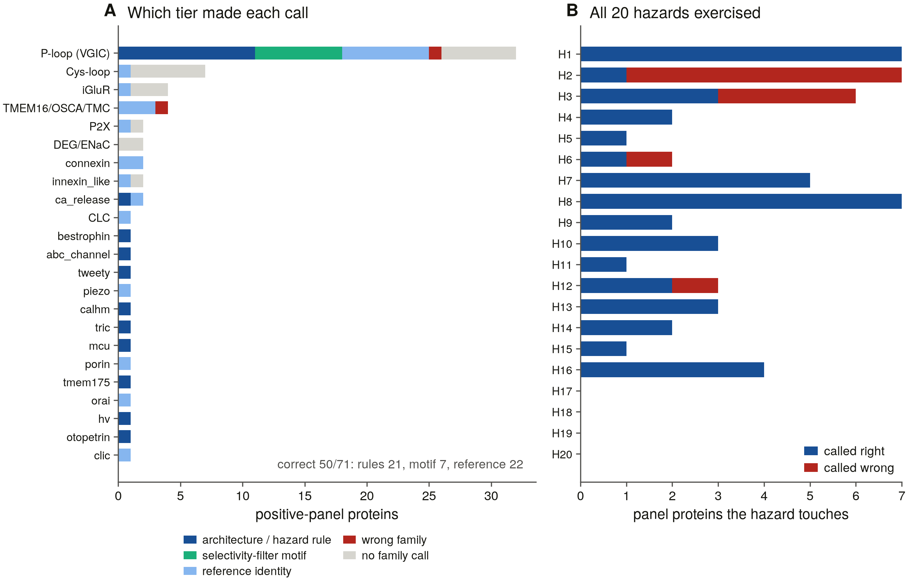

*The 71 positive-panel proteins by the tier that made a correct call (architecture/hazard rule, selectivity-filter motif, reference identity) or by failure, per superfamily: most correct calls do not come from nearest-neighbour identity. **B** — every one of the 16 hazards the S1 panel exercises, called right and wrong (H2's absence rule failing is what S2b later rewrote; H17–H20 came later and are tested in the r4 benchmark). Drawn from `results/benchmark_controls/` by `scripts/s1_figures.py`.*

**S2 — census v2.**

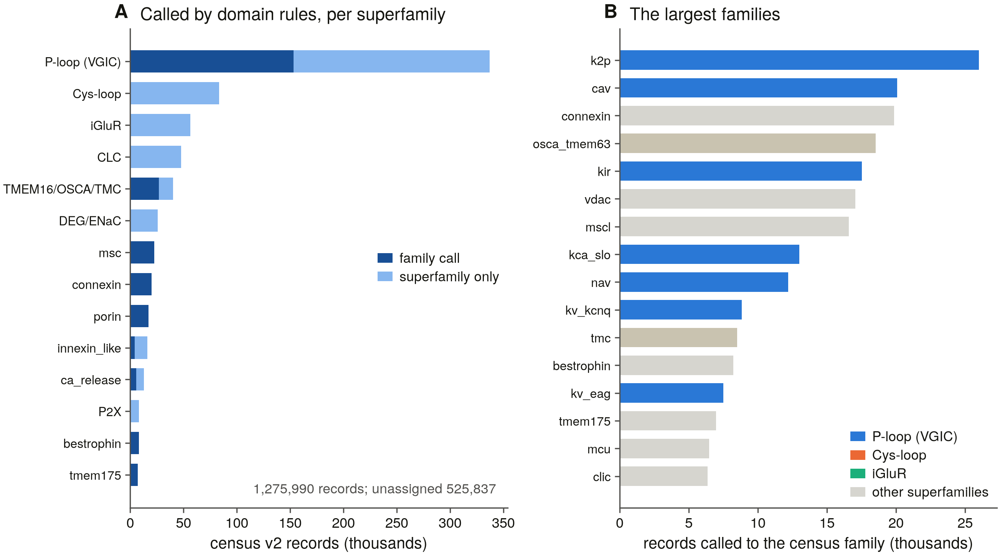

*Census v2 (now revision r4, 1,271,983 records). **A** — records per superfamily called to a family by S2's domain rules or stopping at the superfamily: Cys-loop, iGluR, CLC, DEG/ENaC and P2X stop there by design, their families sharing one architecture. **B** — the largest census families by domain-rule calls. Drawn from `results/census_v2/` by `scripts/s2_figures.py`.*

**S3a — the profile library.**

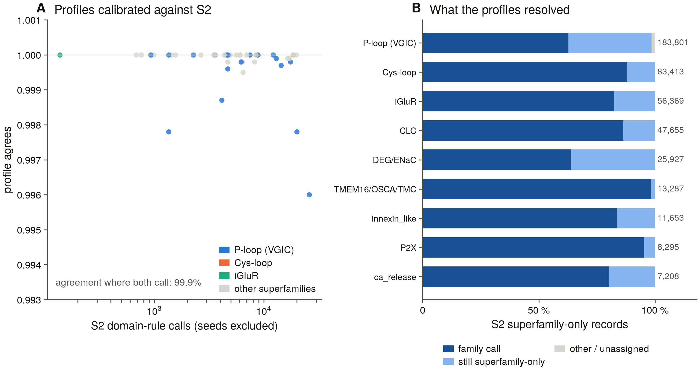

*Where S2's domain rules and the S3a profiles both make a call they agree 99.9 % of the time (seeds excluded; **A**, one dot per family). **B** — S2's superfamily-only records by what the profiles made of them. Drawn from `results/census_v3/` by `scripts/s3_figures.py`.*

**S4 — the declared denominator.**

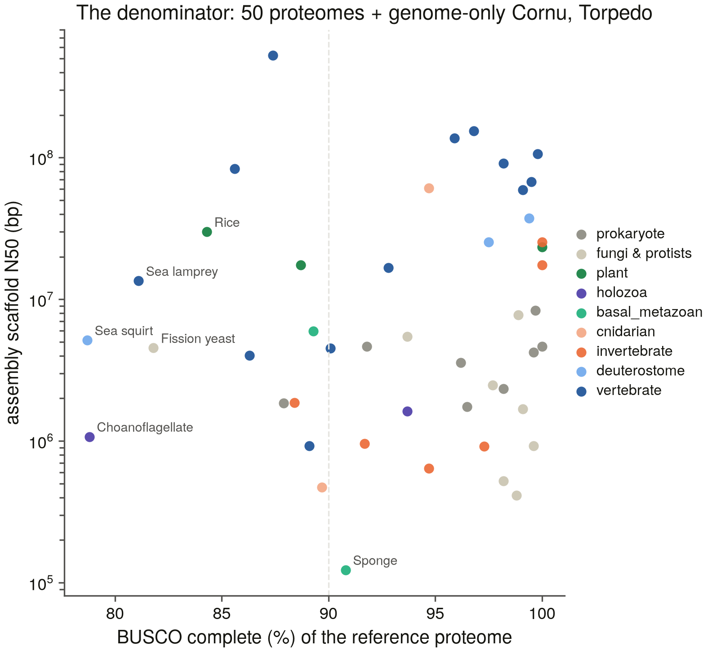

*The 50 reference proteomes of the panel by BUSCO completeness and their assembly's scaffold N50, coloured by panel group; *Cornu* and *Torpedo* are genome-only. Drawn from `results/proteome_scope/proteome_manifest.tsv` by `scripts/s4_figures.py`.*

**S3b — what domain search missed in the panel.**

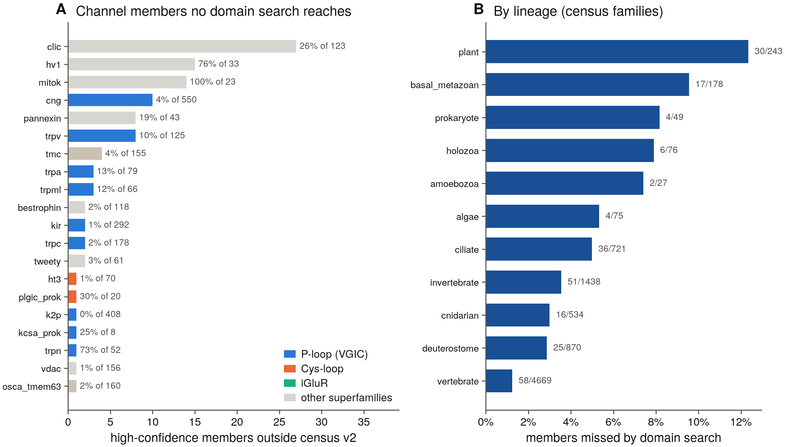

*High-confidence census-family members of the 50 proteomes that carry no enumerated pore signature (**A**, by family, with the share of the family), and the miss rate by lineage (**B**, census families only): 1 % in vertebrates, 12 % in plants. Includes the r4 families (MITOK has no Pfam domain at all). Drawn from `results/panel_sweep/` by `scripts/s3b_figures.py`.*

**S5b — the presence matrix.**

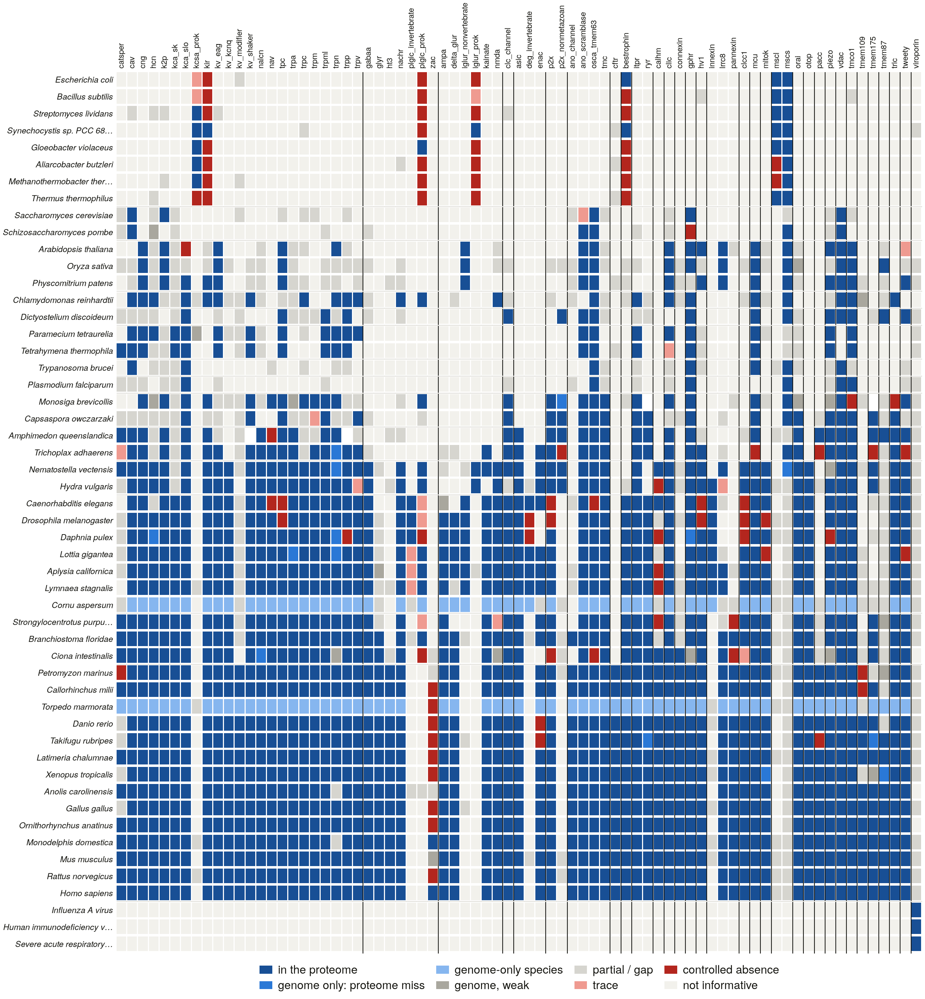

*Every census family (columns, grouped by superfamily) in every panel species (rows), coloured by its genome verdict — the matrix S10's repertoire reconstruction starts from. Drawn from `results/genome_sweep/cells.tsv` by `scripts/s5_figures.py`.*


**S6 — the alignments and the pore modules.**

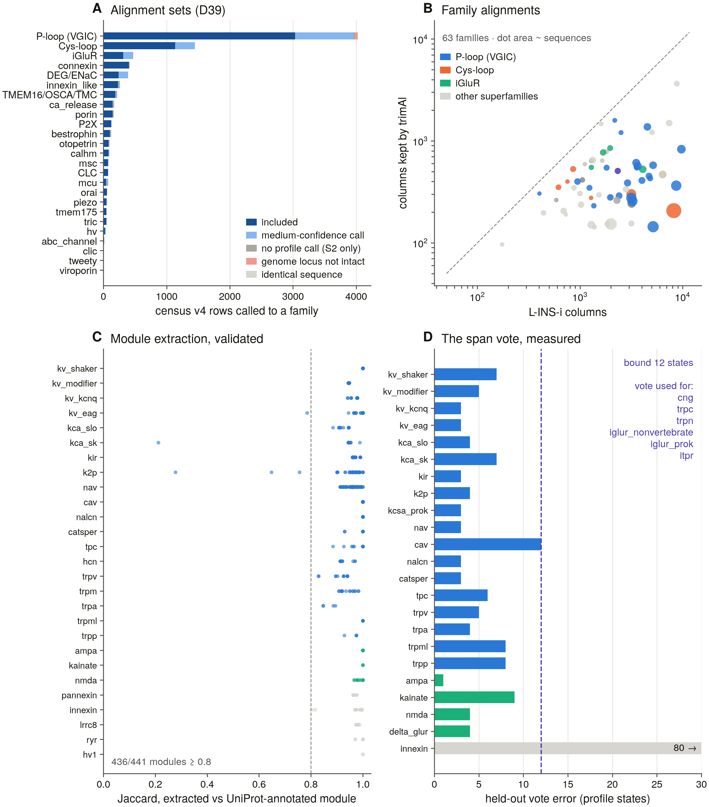

*What went into the trees, and whether the pore modules are right. **A** — every census v4 row called to a family, by superfamily: included in an alignment (high-confidence profile call or intact genome locus, D39) or excluded, with the reason. **B** — each family's L-INS-i alignment against the columns trimAl keeps (dot area ~ sequences): the largest, most divergent families keep 3–4 %. **C** — each extracted pore module against the same protein's own UniProt-annotated module (never a reference's): median Jaccard 0.97. **D** — the vote that places the module in the six unannotated families, measured with a held-out model on the annotated ones: ≤ 12 profile states across P-loop and iGluR, not usable in the innexin clan (where every family is annotated). Drawn from `results/alignments/` by `scripts/s6_figures.py`.*

**S7a — trimming for the tier-1 trees.**

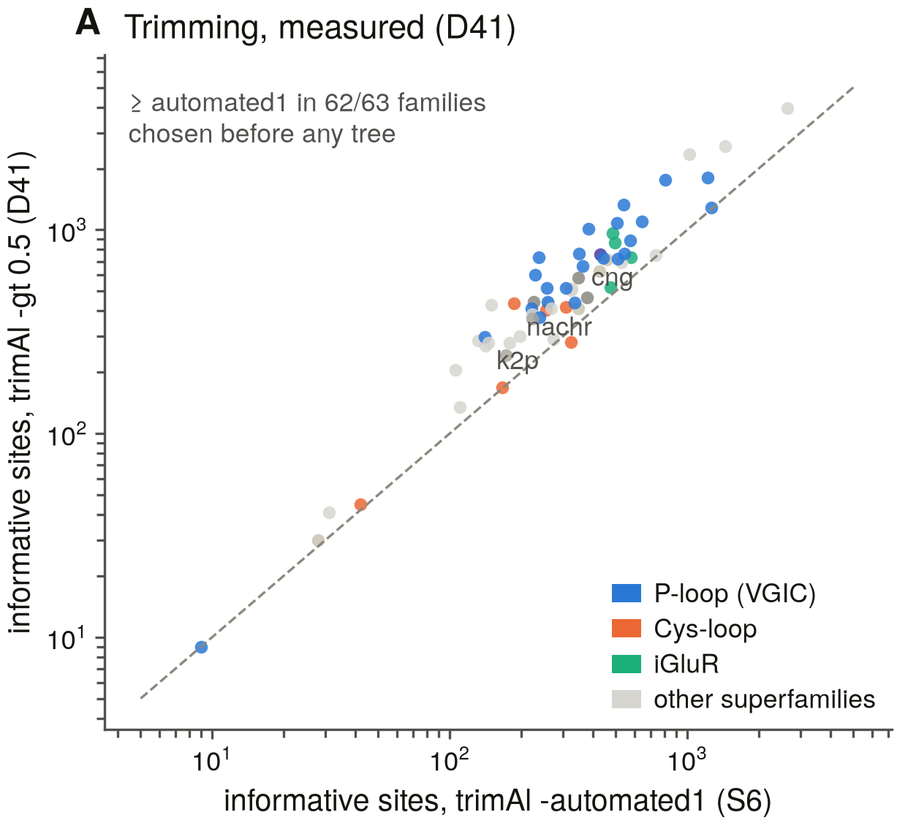

*The trimming for the family trees, chosen before any tree existed (D41). One dot per family alignment: informative sites under S6's trimAl `-automated1` (x) against the `-gt 0.5` gap threshold adopted for S7 (y), log scales, dashed line equal. `-gt 0.5` keeps at least as many in 62 of 63 families (median 504 against 324), doubling K2P and nAChR. Drawn from `results/phylogeny/tier1_trim_compare.tsv` by `scripts/s7_figures.py`.*

**S20 — what the published channelome is made of.**

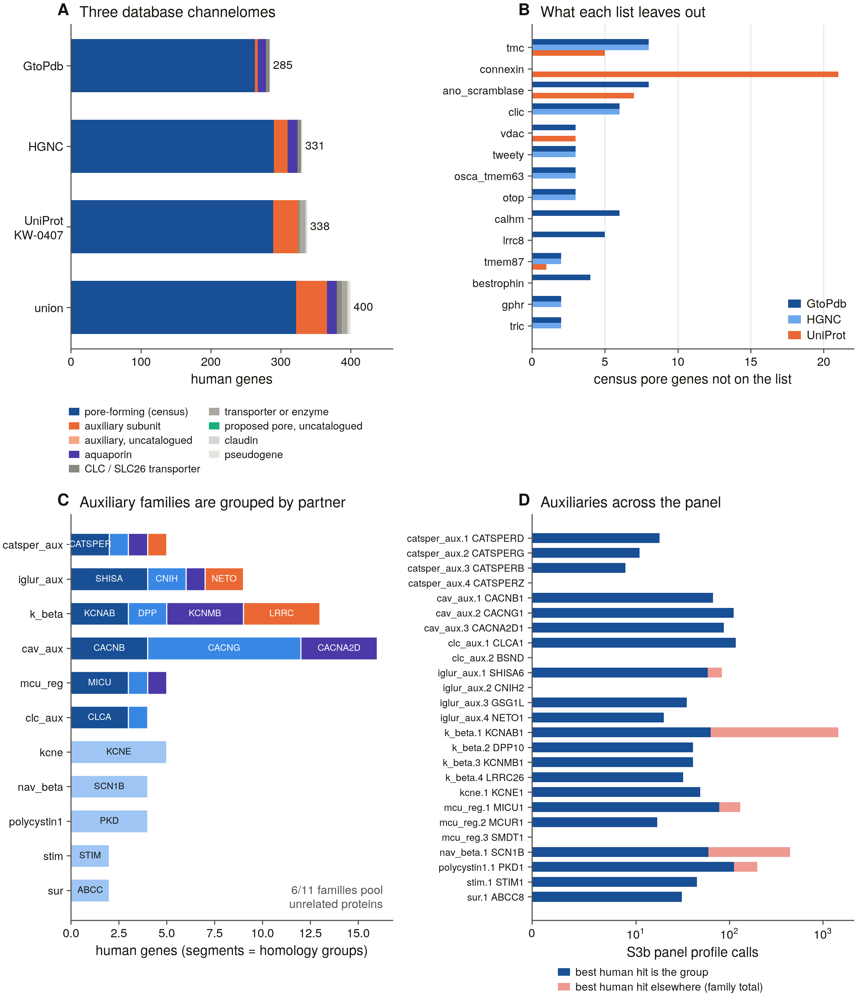

*The 240–400 spread of human channel counts, measured. **A** — GtoPdb, HGNC and UniProt KW-0407 lists (and their union, 400) split into this catalogue's pore-forming census genes and everything else, by reason. **B** — census pore genes each list leaves out: contested and large-pore families, and all 21 connexins in UniProt. **C** — the auxiliary families against their homology groups (phmmer, E ≤ 1e-3): six of eleven pool unrelated proteins. **D** — S3b panel calls to auxiliary families that pass a reciprocal-best-human-hit test (blue) against those whose best human hit is an unrelated LRR, Ig or other protein (red). Drawn from `results/auxiliary/` by `scripts/s20_figures.py`.*

**S15 — what each method contributes.**


*Q3, measured. **A** — each superfamily's final-census members (census v4, high-confidence profile calls and intact genome loci) by the first method that finds them: domain search calling the right family (dark blue), domain search finding the record without naming its family (light blue), profile HMMs alone (orange), the genome sweep alone (green). **B** — the independent frame: the curated human genes per superfamily that domain search enumerates, that domain rules call right, and that the profiles call right. Drawn from `results/method_contribution/` by `scripts/s15_figures.py`.*

**S2d — census revision r4 for the families added after S20.**

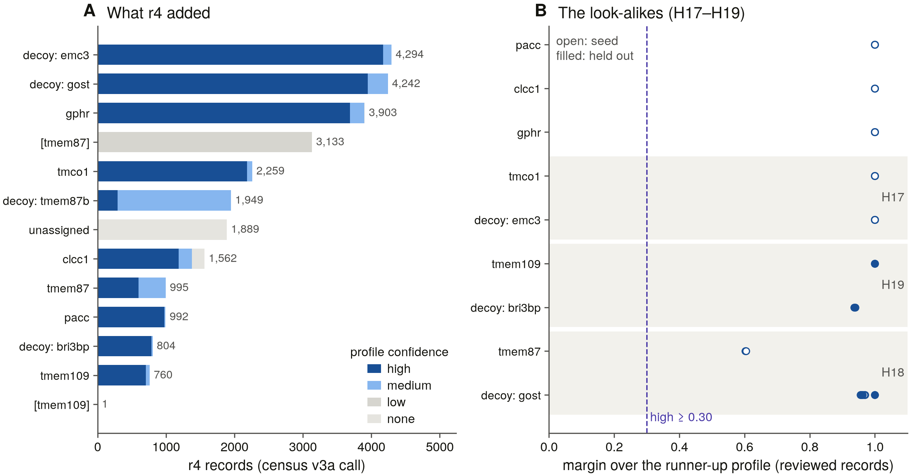

*What bringing the eight added channels into the census found. **A** — the 26,783 records revision r4 added, by their census call and profile confidence: TMEM87B has its own decoy since the reseed (D44), and the TMEM87 records that no profile can place stop at the superfamily (`[tmem87]`). **B** — every reviewed r4 record's margin over the runner-up profile (dashed line: the 0.30 high-confidence bar). TMCO1/EMC3 (H17) and TMEM109/BRI3BP (H19) separate at margins of 0.94–1.0; TMEM87A/B (H18) separate at ~0.60 in mammals, while the held-out *Xenopus* tmem87a falls to TMEM87B. Drawn from `results/census_v3/r4_*.tsv` by `scripts/s3r4_figures.py`.*

**S5c — the r4 families in the 52 genomes.**

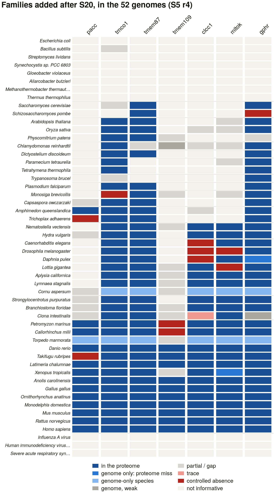

*Each new census family (columns) in each panel species (rows, grouped from prokaryotes to human), coloured by its S5 verdict: in the proteome; found only in the genome (a proteome miss, or a genome-only species); partial or gap; trace; a controlled absence (in-group bait, detection ≥ 0.90, D4 bar met); or not informative (no in-group bait). TMEM87's scattered pattern outside mammals is the unresolved TMEM87A/B paralogue split (H18), not a range. Drawn from `results/genome_sweep/r4_cells.tsv` by `scripts/s5r4_figures.py`.*
---

## What makes this hard, in three examples

**A domain hit is not a family.** `PF00520` — the pore module — is carried by
20 catalogued families, including a phosphatase that is not a channel and a
proton channel that has no pore domain. Nav, Cav, NALCN and CatSper carry
four copies each and nothing else that distinguishes them.

What separates them is the selectivity filter: one residue from each repeat.
Align to human Nav1.5 and read positions 372 / 898 / 1419 / 1711:

```
   SCN5A   → DEKA      CACNA1C → EEEE      NALCN   → EEKE
   SCN1A   → DEKA      CACNA1G → EEDD      SCN11A  → DEKA
```

Six of six correct, ~1.1 s per protein. `CACNA1G` reading **EEDD** rather
than EEEE is not an error — the T-type channels really do differ at the
filter, and the classifier records the subfamily rather than flattening it.

**Most TRP channels carry no `PF00520` at all.** Measured 2026-08-19: TRPV1,
TRPV5, TRPA1 and TRPM2 do; TRPC3, TRPM8, MCOLN1, MCOLN2 and PKD2 do not.
A census enumerating P-loop channels by that accession loses most of the TRP
division silently, so this one enumerates from the union of seven pore
models instead.

**There is no tree of ion channels.** A nicotinic receptor and a Kv channel
share no alignable position. `build_tier2()` raises `NotAlignable` for any
superfamily the catalogue marks non-homologous, and there is no
`build_tier3()`: cross-superfamily comparison produces a fold-similarity
network with no branch lengths and no support values.

---

## Layout

```
src/catalogue/    the subject: 103 families, 32 superfamilies, 20 hazards
src/classify/     three tiers → one ChannelCall with an audit trail
src/phylo/        pore modules, tier-1/tier-2 forests, the tier-3 network
src/utils/scope.py  narrows the catalogue to a run's scope
src/core, src/databases, src/analysis, src/discovery, src/investigation, src/gui
                  the ported app (NCBI / Ensembl / UniProt / Compara /
                  AlphaFold / Foldseek / BLAST, MSA, trees, discovery scoring)
scripts/          per-task tooling; s0_* verification, s1_* benchmark,
                  s14_* manuscript assembly, dashboard, figure style
docs/             the biology baseline, the scope decision, the
                  classification rules, the phylogeny protocol, task briefs
presets/          channelome_human, controls_benchmark, and scoped surveys
results/          committed tables and reports, one directory per task
```

Read `INTERFACE.md` before opening any source file.

---

## The rules this project runs on

The full Decisions log is in `PUBLICATION_ROADMAP.md`; D1–D18 are inherited
from the PIEZO and IP3R projects, D23–D28 are new here.

- **D23** The scope of "ion channel" is declared, not assumed — six boundary
  questions with six recorded answers, and anything excluded stays in the
  catalogue with a status so the exclusion is a decision rather than an
  omission.
- **D24** Membership and mechanism are separate calls. The CLC transporters
  are in the CLC family and are not channels.
- **D25** A signature is evidence only at the level where it is diagnostic.
- **D26** The four-repeat families are separated by their selectivity filter,
  verified against the reference before every use.
- **D27** The phylogeny is a forest; non-alignable comparisons go to the fold
  network, and the code refuses to do otherwise.
- **D28** A missing tool disables a test loudly. No silent fallback to a
  weaker method, ever.
- **H15** The gene symbol is never consulted. `KCNE*`, `CACNB*`, `CACNG*`,
  `SCN*B`, `CATSPERB` and `KCTD*` all sort inside the channel symbol space
  and none is a pore.

---

## Provenance

Ported from `../ip3r_genes` (the IP3 receptor family), itself ported from
`../piezo_genes`. The app, the figure style, the dashboard, the
manuscript-assembly and claim-checking tooling and the session protocol come
from there; **no result does**. ITPR and RYR appear here as two of 103
families, and the parent project's census of them is an external check on
this one rather than an input to it.

Findings so far: `FINDINGS.md`. Operational record: `SESSION_LOG.md`.
