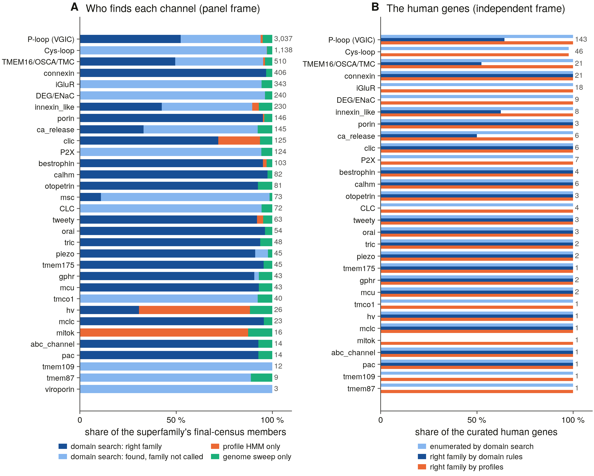

# S15 — what each method contributes (Q3)

Rendered by `scripts/s15_report.py` from the tables in this directory (D13), which `scripts/s15_contribution.py` derives from census v4 (`<data root>/genomes/s5/census_v4.tsv.gz`) and the S2/S3b human-recall tables.

## The answer

**Domain search finds the channels; it cannot name most of them.** Of the final census's 7,353 high-confidence census-family members (panel frame, below), **94.0% carry an enumerated pore signature**, but S2's domain rules call only **44.2%** of them to the family the profiles do. Profiles add 107 proteome members domain search never enumerated (1.5%); genomes add 334 loci the proteomes lack (4.5%).

On the independent human frame (the 328 curated census genes): domain search enumerates **326**, calls **173** to the right family, and the profiles call **327**.

**Per superfamily (thresholds fixed in `s15_contribution.py` before any row was read: ≥ 95% / ≥ 50%)** — enumeration: domain_search 29, profile_or_genome_only 2, domain_partial 1; the family *call*: profile_or_genome_only 14, domain_search 14, domain_partial 4. Enumeration is not the bottleneck anywhere except clic (77%), hv (35%), mitok (0%). The call is: in cysloop, deg_enac, p2x, clc, tmco1, mitok, tmem109, tmem87, viroporin domain rules call **no** member to its family, because the families inside each share one architecture (D25) — S2 stops at the superfamily and only the profiles separate them.

## Two frames

* **Human frame — independent truth.** The catalogue's 320 human census genes, curated from the literature, never from a census method.
* **Panel frame — the final census.** Every census v4 row the S3a profiles call to a census family at high confidence (D32), genome loci only with an intact frame (D37); contested families kept. The frame is defined by the best instrument, so the profile step reaches 100 % of proteome rows by construction: the curve measures what domain search misses *relative to it*. The profile step's own completeness is checked independently by jackhmmer (last column, S3b clean runs only, D10).

## The curve, per superfamily

| superfamily | members | domain call | + domain enumeration | + profile | + genome | Q3 (enumeration) | Q3 (call) | domain-only calls | human: enumerated / domain call / profile | jackhmmer recall (clean runs) |
|---|---|---|---|---|---|---|---|---|---|---|
| ploop | 3037 | 52% | 94% | 95% | 100% | domain_search | domain_partial | 22 | 143 / 92 / 143 of 143 | 290/290 |
| cysloop | 1138 | 0% | 97% | 97% | 100% | domain_search | profile_or_genome_only | 0 | 45 / 0 / 45 of 46 | 1305/1305 |
| tmem16_like | 510 | 50% | 95% | 96% | 100% | domain_search | domain_partial | 3 | 21 / 11 / 21 of 21 | 152/152 |
| connexin | 406 | 97% | 97% | 97% | 100% | domain_search | domain_search | 2 | 21 / 21 / 21 of 21 | 399/399 |
| iglur | 343 | 0% | 94% | 94% | 100% | domain_search | profile_or_genome_only | 0 | 18 / 0 / 18 of 18 | no clean run |
| deg_enac | 240 | 0% | 96% | 96% | 100% | domain_search | profile_or_genome_only | 0 | 9 / 0 / 9 of 9 | 379/379 |
| innexin_like | 230 | 43% | 90% | 93% | 100% | domain_search | profile_or_genome_only | 8 | 8 / 5 / 8 of 8 | no clean run |
| porin | 146 | 95% | 95% | 96% | 100% | domain_search | domain_search | 13 | 3 / 3 / 3 of 3 | 143/143 |
| ca_release | 145 | 33% | 92% | 92% | 100% | domain_search | profile_or_genome_only | 2 | 6 / 3 / 6 of 6 | no clean run |
| clic | 125 | 72% | 72% | 94% | 100% | domain_partial | domain_partial | 0 | 6 / 6 / 6 of 6 | no clean run |
| p2x | 124 | 0% | 94% | 94% | 100% | domain_search | profile_or_genome_only | 0 | 7 / 0 / 7 of 7 | 121/121 |
| bestrophin | 103 | 95% | 95% | 97% | 100% | domain_search | domain_search | 11 | 4 / 4 / 4 of 4 | 105/107 |
| calhm | 82 | 98% | 98% | 98% | 100% | domain_search | domain_search | 2 | 6 / 6 / 6 of 6 | 91/91 |
| otopetrin | 81 | 93% | 93% | 93% | 100% | domain_search | domain_search | 9 | 3 / 3 / 3 of 3 | 80/80 |
| msc | 73 | 11% | 99% | 99% | 100% | domain_search | profile_or_genome_only | 0 | 0 / 0 / 0 of 0 | 82/82 |
| clc | 72 | 0% | 94% | 94% | 100% | domain_search | profile_or_genome_only | 0 | 4 / 0 / 4 of 4 | no clean run |
| tweety | 63 | 92% | 92% | 95% | 100% | domain_search | domain_search | 1 | 3 / 3 / 3 of 3 | no clean run |
| orai | 54 | 96% | 96% | 96% | 100% | domain_search | domain_search | 7 | 3 / 3 / 3 of 3 | 52/52 |
| tric | 48 | 94% | 94% | 94% | 100% | domain_search | domain_search | 1 | 2 / 2 / 2 of 2 | 45/45 |
| piezo | 45 | 91% | 98% | 98% | 100% | domain_search | domain_partial | 0 | 2 / 2 / 2 of 2 | no clean run |
| tmem175 | 45 | 96% | 96% | 96% | 100% | domain_search | domain_search | 4 | 1 / 1 / 1 of 1 | 44/44 |
| gphr | 43 | 91% | 93% | 93% | 100% | domain_search | domain_search | 0 | 2 / 2 / 2 of 2 | no clean run |
| mcu | 43 | 93% | 93% | 93% | 100% | domain_search | domain_search | 10 | 2 / 2 / 2 of 2 | 63/63 |
| tmco1 | 40 | 0% | 92% | 92% | 100% | domain_search | profile_or_genome_only | 0 | 1 / 0 / 1 of 1 | no clean run |
| hv | 26 | 31% | 31% | 88% | 100% | profile_or_genome_only | profile_or_genome_only | 0 | 1 / 1 / 1 of 1 | no clean run |
| mclc | 23 | 96% | 96% | 96% | 100% | domain_search | domain_search | 4 | 1 / 1 / 1 of 1 | no clean run |
| mitok | 16 | 0% | 0% | 88% | 100% | profile_or_genome_only | profile_or_genome_only | 0 | 0 / 0 / 1 of 1 | no clean run |
| abc_channel | 14 | 93% | 93% | 93% | 100% | domain_search | domain_search | 0 | 1 / 1 / 1 of 1 | no clean run |
| pac | 14 | 93% | 93% | 93% | 100% | domain_search | domain_search | 0 | 1 / 1 / 1 of 1 | no clean run |
| tmem109 | 12 | 0% | 100% | 100% | 100% | domain_search | profile_or_genome_only | 0 | 1 / 0 / 1 of 1 | no clean run |
| tmem87 | 9 | 0% | 89% | 89% | 100% | domain_search | profile_or_genome_only | 0 | 1 / 0 / 1 of 1 | no clean run |
| viroporin | 3 | 0% | 100% | 100% | 100% | domain_search | profile_or_genome_only | 0 | 0 / 0 / 0 of 0 | 1/3 |

*Domain-only calls*: S2 family calls on census v4 rows the profiles do not call (census v3 basis `s2_only`) — domain search's unique contribution, outside the frame because no profile confirms them.

## Where domain search misses, by lineage

Domain enumeration recall by panel group (proteome rows), superfamilies with a group below 95 %:

| superfamily | group | members | enumerated | family call |
|---|---|---|---|---|
| clic | ciliate | 4 | 0% | 0% |
| clic | cnidarian | 6 | 50% | 50% |
| clic | deuterostome | 5 | 80% | 80% |
| clic | invertebrate | 14 | 64% | 64% |
| clic | plant | 9 | 0% | 0% |
| hv | invertebrate | 8 | 0% | 0% |
| hv | vertebrate | 13 | 62% | 62% |
| innexin_like | deuterostome | 4 | 25% | 0% |
| mitok | vertebrate | 12 | 0% | 0% |
| ploop | amoebozoa | 6 | 83% | 50% |
| ploop | basal_metazoan | 46 | 89% | 39% |
| ploop | prokaryote | 5 | 80% | 0% |
| tmem16_like | holozoa | 9 | 89% | 67% |
| tmem16_like | invertebrate | 44 | 91% | 52% |

## What the genome sweep adds

Genome loci in the frame come from the two genome-only species (*Cornu*, *Torpedo*) and the proteome misses S5b confirmed. Largest by family: k2p 20, kir 17, gabaa 14, kv_shaker 14, connexin 13, nachr 12, trpc 12, ano_scramblase 9.

## Not done here

* The two method designs the S3b and S5a emergent rows proposed for S15 — a superfamily-seeded jackhmmer and a six-frame profile scan of genomes — are new instruments, not measurements of the existing ones; they stay open rows.
* This measures the census's own methods against each other and against the human gene list. What the *annotation databases* miss or mislabel per locus is S16.
