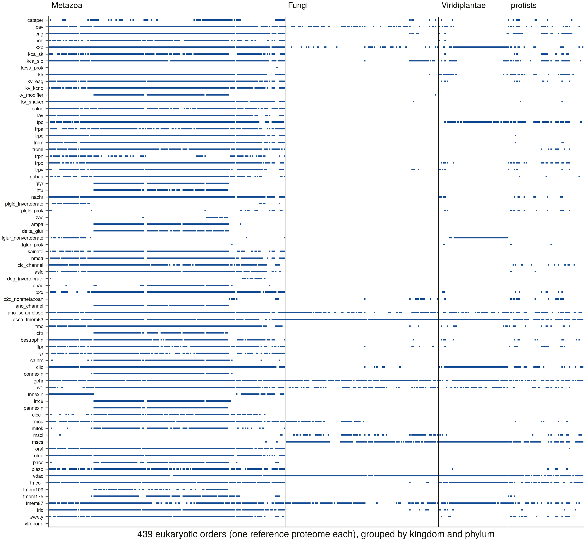

# S4b — the dense panel: one reference proteome per eukaryotic order

Rendered by `scripts/s4b_report.py` from `order_panel.tsv`, `order_panel_files.tsv`, `dense_db.json`, `order_matrix.tsv` and `instrument_check.tsv` (D13). Bulk: `<data root>/proteomes/s4b/`.

**439 orders** from Release 2026_03, 02-Sep-2026's 3,528 eukaryotic reference proteomes (Metazoa 194, Fungi 126, protists 62, Viridiplantae 57); 35 keep their S4-panel proteome. 86 proteomes have no NCBI order rank (mostly protists) and are outside the rule. All files MD5-verified against the release metalink; **8,759,024 sequences**, entry counts equal to the README's for all but human (the D35 reissue).

**Instrument check** — the 35 proteomes shared with the S4 panel: high-confidence family presence agrees with S3b on **2,624 / 2,625** cells (`instrument_check.tsv` lists the rest; same proteome and profiles, only `-Z` and r4–r6's later profile versions differ).

**The matrix**: 12,060 present cells (high-confidence proteome calls) over 439 orders × 75 census families. Absent from every eukaryotic order: viroporin.

| family | orders present | | family | orders present |
|---|---|---|---|---|
| vdac | 422 | | p2x | 173 |
| osca_tmem63 | 402 | | nalcn | 167 |
| gphr | 382 | | piezo | 165 |
| ano_scramblase | 324 | | gabaa | 157 |
| tmem87 | 313 | | trpa | 156 |
| k2p | 284 | | kainate | 150 |
| tmco1 | 281 | | ryr | 149 |
| clic | 273 | | hcn | 148 |
| hv1 | 269 | | clcc1 | 131 |
| cav | 261 | | calhm | 116 |
| tpc | 260 | | tmem175 | 115 |
| kca_slo | 245 | | connexin | 112 |
| mcu | 227 | | mitok | 110 |
| cng | 225 | | lrrc8 | 109 |
| kir | 224 | | ampa | 108 |
| trpp | 205 | | kv_modifier | 108 |
| mscs | 205 | | pacc | 108 |
| tmc | 203 | | glyr | 107 |
| nachr | 201 | | pannexin | 107 |
| tric | 198 | | ano_channel | 106 |
| kv_eag | 192 | | cftr | 101 |
| kv_shaker | 192 | | delta_glur | 98 |
| tweety | 191 | | ht3 | 98 |
| trpc | 188 | | catsper | 86 |
| itpr | 186 | | enac | 76 |
| trpm | 186 | | trpn | 76 |
| trpml | 186 | | mscl | 74 |
| orai | 183 | | iglur_nonvertebrate | 72 |
| bestrophin | 182 | | tmem109 | 70 |
| otop | 181 | | innexin | 67 |
| clc_channel | 179 | | p2x_nonmetazoan | 34 |
| trpv | 179 | | plgic_prok | 33 |
| asic | 175 | | plgic_invertebrate | 32 |
| kca_sk | 175 | | zac | 17 |
| kv_kcnq | 175 | | deg_invertebrate | 15 |
| nav | 175 | | iglur_prok | 4 |
| nmda | 175 | | kcsa_prok | 1 |

**What these cells are (D46).** Each is a proteome call: present = a high-confidence S3a profile call in that order's reference proteome. An empty cell is an **annotation-level absence** — no S5 genome check, no matched-bait control. S10 states absences as *controlled* (S5, the 52 species) or *proteome-only* (here), never merged.
