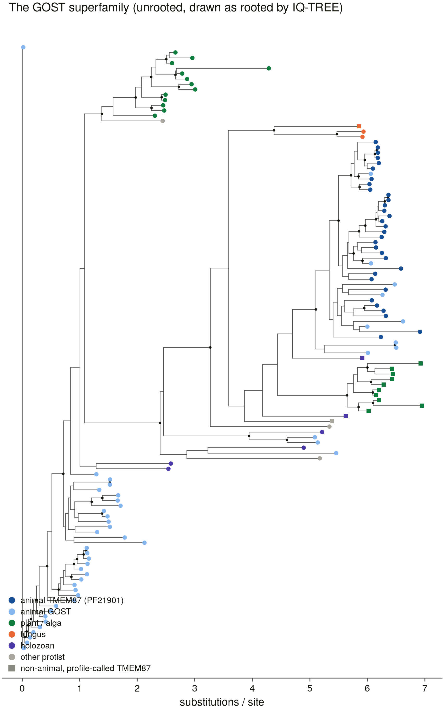

# The GOST superfamily tree — is TMEM87 animal-specific?

Rendered by `scripts/s7_gost_tree.py read` from `summary.json` and `nonanimal_placement.tsv` (D13).

**115 panel proteins** the profiles place in the TMEM87/GOST superfamily; MAFFT L-INS-i, trimAl `-gt 0.5` (442 columns), IQ-TREE 2 `-m MFP -mset LG,WAG,JTT,Q.pfam -B 1000 -bnni -seed 1` (model Q.pfam+R7). Unrooted: every question is a split.

**1. TMEM87 is a pan-eukaryotic lineage; its GOLD domain is an animal addition.** The largest clade holding all 32 animal TMEM87s (PF21901 carriers) and none of the 38 animal GPR107/108s has UFBoot 100 and contains **17 of 36 non-animal GOST proteins** — plants, moss, fungi, *Dictyostelium*, *Plasmodium*, the choanoflagellate and *Capsaspora* (`tmem87_lineage_nesting.tsv` gives the nested clades and their support). The profile calls agree with the tree on **33/36** non-animal proteins (TMEM87 call ⇔ TMEM87 lineage). A first reading of this tree took the smallest clade instead and concluded the opposite; it was wrong.

**2. The TMEM87A/B duplication is not dated by this tree.** Neither paralogue forms a clade, nor do the vertebrate A and B genes together against the invertebrates. D45's grounds stand on what was measured — profiles cannot separate non-mammalian TMEM87 into A and B — but its premise that the split is a vertebrate duplication is unverified here.

| non-animal protein | species | profile call | tree placement |
|---|---|---|---|
| CAOG_003166 | Capsaspora owczarzaki | nonchannel_gost | GOST (GPR107/108) side |
| CAOG_005036 | Capsaspora owczarzaki | tmem87 | TMEM87 lineage |
| CAOG_003088 | Capsaspora owczarzaki | nonchannel_gost | GOST (GPR107/108) side |
| CAOG_004352 | Capsaspora owczarzaki | nonchannel_gost | GOST (GPR107/108) side |
| Os01g0836700 | Oryza sativa | nonchannel_gost | GOST (GPR107/108) side |
| Os04g0508600 | Oryza sativa | nonchannel_gost | GOST (GPR107/108) side |
| Os05g0462500 | Oryza sativa | nonchannel_gost | GOST (GPR107/108) side |
| Os07g0614600 | Oryza sativa | tmem87 | TMEM87 lineage |
| LOC112287746 | Physcomitrium patens | nonchannel_gost | GOST (GPR107/108) side |
| CHLRE_12g523950v5 | Chlamydomonas reinhardtii | nonchannel_gost | GOST (GPR107/108) side |
| LOC112287805 | Physcomitrium patens | tmem87 | TMEM87 lineage |
| LOC112278721 | Physcomitrium patens | tmem87 | TMEM87 lineage |
| LOC112291278 | Physcomitrium patens | nonchannel_gost | GOST (GPR107/108) side |
| MONBRDRAFT_35943 | Monosiga brevicollis | tmem87 | TMEM87 lineage |
| MONBRDRAFT_27427 | Monosiga brevicollis | nonchannel_gost | GOST (GPR107/108) side |
| DDB_G0285943 | Dictyostelium discoideum | tmem87 | TMEM87 lineage |
| At1g61670 | Arabidopsis thaliana | tmem87 | TMEM87 lineage |
| At2g01070 | Arabidopsis thaliana | tmem87 | TMEM87 lineage |
| CAND7 | Arabidopsis thaliana | nonchannel_gost | GOST (GPR107/108) side |
| At1g10980 | Arabidopsis thaliana | tmem87 | TMEM87 lineage |
| SPAC26H5.07c | Schizosaccharomyces pombe | tmem87 | TMEM87 lineage |
| PTM1 | Saccharomyces cerevisiae | nonchannel_gost | TMEM87 lineage |
| YHL017W | Saccharomyces cerevisiae | nonchannel_gost | TMEM87 lineage |
| Os02g0618700 | Oryza sativa | nonchannel_gost | GOST (GPR107/108) side |
| Os03g0334800 | Oryza sativa | tmem87 | TMEM87 lineage |
| Os11g0546100 | Oryza sativa | tmem87 | TMEM87 lineage |
| DDB_G0291203 | Dictyostelium discoideum | nonchannel_gost | GOST (GPR107/108) side |
| DDB_G0286487 | Dictyostelium discoideum | nonchannel_gost | GOST (GPR107/108) side |
| Os09g0439700 | Oryza sativa | tmem87 | TMEM87 lineage |
| PF3D7_1215900 | Plasmodium falciparum | superfamily_only | TMEM87 lineage |
| Os01g0836800 | Oryza sativa | nonchannel_gost | GOST (GPR107/108) side |
| At3g09570 | Arabidopsis thaliana | nonchannel_gost | GOST (GPR107/108) side |
| At1g72480 | Arabidopsis thaliana | tmem87 | TMEM87 lineage |
| MJC20.20 | Arabidopsis thaliana | nonchannel_gost | GOST (GPR107/108) side |
| CAND6 | Arabidopsis thaliana | nonchannel_gost | GOST (GPR107/108) side |
| Os06g0132100 | Oryza sativa | nonchannel_gost | GOST (GPR107/108) side |
